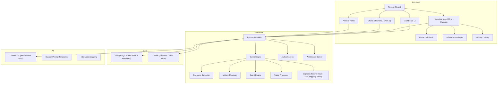
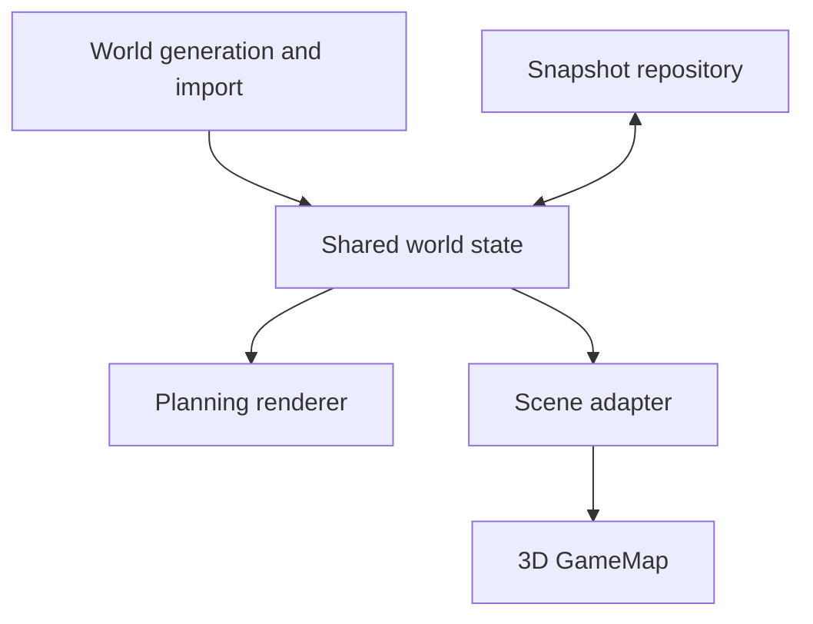

# PangeaWorld Architecture & Instructions


## File Map
The current structure of the PangeaWorld repository:

```
PangeaWorld/
├── PangeaWorld_architecture_and_instructions.md (Canonical architecture and roadmap)
├── backend/
│   └── main.py                                (Initial FastAPI backend setup)
└── frontend/
    ├── package.json / vite.config.js          (Vite tooling configuration)
    ├── index.html                             (Vite entry point)
    ├── src/
    │   ├── components/GameMap.jsx             (Canonical snapshot-backed React Canvas renderer)
    │   ├── utils/MapGenerator.js              (One-time seeded map generator)
    │   └── utils/MapSnapshot.js               (Snapshot serialization and hydration)
    ├── src/utils/MapGenerator.test.js         (Seeded and snapshot regression suite)
    ├── e2e/four-player.spec.js                (Isolated four-browser acceptance path)
    └── public/
        ├── favicon.svg / icons.svg
        └── map_prototype.html                 (Standalone Canvas map kept behaviorally aligned)
```

### Current application additions

- `backend/database.py` owns the local SQLite connection. The canonical local development database is `backend/pangeaworld.db`; root-level `.db` copies are disposable and ignored.
- `backend/auth.py`, `backend/deadlines.py`, and `backend/realtime.py` support multiplayer authentication, phase timing, and session-scoped real-time updates.
- `backend/engines/`, `backend/models/`, `backend/routes/`, and `backend/tests/` contain the authoritative game engines, domain/schema layer, API routes (including Phase 3), and regression suites.
- `frontend/src/api/client.js`, `context/GameContext.jsx`, `hooks/useSessionEvents.js`, and the President/Executive dashboard component trees provide the API-backed gameplay interface.

## Tools Used
- **Map Prototype**: Built entirely with Vanilla JavaScript, HTML5 `<canvas>`, and CSS.
- **Procedural Generation**: Utilizes pure math (composite sine/cosine waves, Voronoi partitioning, and distance calculations) instead of external noise libraries (like Perlin) to generate natural shapes and borders.
- **Frontend Framework**: React single-page application built and served with Vite.
- **Map Renderer**: HTML5 Canvas hosted inside React. D3.js, Mapbox, and a Next.js migration are not part of the canonical architecture.
- **Backend Framework**: Scaffolded using Python FastAPI.

## Expected Behaviors
- **Preview Map Generation**: The standalone `map_prototype.html` is a non-authoritative visual and interaction reference. It may generate a new transient layout when reloaded, and its changes are discarded when the page closes.
- **Game-Session Map Generation**: A real game receives one server-issued seed when the session is created. `MapGenerator.js` generates it once, the full geometry and state are persisted, and the canonical React `GameMap` subsequently hydrates only from that snapshot; refreshing a client never regenerates it.
- **Natural Borders**: The 8 countries are divided using a Voronoi diagram based on fixed capital anchor points, enhanced with 2D noise to create squiggly, organic borders.
- **Map Adjustments**: Zephyria is positioned on the main continent between Nordvik and Drakmoor, reducing Terranova's coastline. Zephyria is landlocked with no sea access; its core challenge is securing resources and negotiating road access through neighboring nations, and its main resource is cheap labor for other nations opening new cities. Lunara has a small land connection (strait) to the mainland.
- **Canonical Starting Settlement Counts**: Every nation starts with **exactly 8 cities total**. Port cities are included in this total rather than added on top of it.
- **Canonical Starting Port Counts**: Nordvik and Lunara each start with **exactly 2 ports**. Drakmoor starts with **exactly 1 port**; it is coastal but has deliberately constrained sea access, not a landlocked nation. All other nations (Valdoria, Terranova, Korvath, Solhaven, and Zephyria) start with **0 ports**. Zephyria is fully landlocked with no sea access.
- **Interactive Grid**: The prototype demonstrates edge-hover and railroad interactions. The multiplayer `GameMap` is read-only for players; future validated infrastructure commands will be the only authoritative mutation path.
- **Dynamic Labels**: The country labels (e.g. "Terranova") dynamically position themselves deep within their respective borders based on the procedural shape formula.
- **Zoom Controls**: The sidebar features a "Map Controls" panel with a slider to zoom the canvas in and out, preserving interaction accuracy.

## Architectural Constraints
- **Procedural Generation Contract**: The procedural map remains seed-driven and may generate different layouts for different games, but every generated map must satisfy the locked gameplay invariants below. Corrective changes to generation or validation logic are permitted when required to enforce those invariants; changes must be covered by deterministic seed-based tests and must not silently change unrelated terrain rules.
- **Canonical Frontend Contract**: React + Vite is the only application frontend. HTML Canvas is the canonical map renderer. The standalone HTML map remains a development preview, not a second game client.
- **Server Authority Contract**: FastAPI owns authoritative game state, decision validation, round transitions, economy calculations, random seeds, and persisted results. React renders server state and submits commands; client calculations may be previews only and cannot determine official outcomes.
- **Deterministic Simulation Contract**: A stored ruleset version, session seed, starting snapshot, and ordered decision ledger must reproduce the same round results. Authoritative randomness is seeded and executed on the server.
- **Opportunity-Cost Contract (Required)**: Every material Presidential and Company Executive decision must consume or commit a scarce resource (for example treasury/cash, borrowing capacity, labor, production capacity, inventory, political capital, diplomatic leverage, military readiness, or time) and therefore rule out, delay, or weaken at least one feasible alternative. The product must make that trade-off visible before submission and report it after resolution. A feature is not complete if it presents benefits and direct costs but hides the value of the next-best foregone alternative, permits unconstrained allocation, or creates an obviously dominant choice with no meaningful sacrifice.

## Game Rules (As implemented)
- **Railroad Construction**: Building a standard railroad costs **$1M** per segment.
- **Bridges**: Railroads built over river edges cost **$3M** per segment.
- **Mountain Railroads**: Railroads built on the passable sides of mountains cost **$1.5M** per segment.
- **Impassable Ocean**: Edges touching ocean triangles cannot be built upon.
- **Mountain Mazes**: Mountain generation creates clustered mountain ranges. Crucially, every mountain triangle has **exactly 1 passable edge** (with the other 2 being impassable). This forces players to navigate winding valleys and find specific "passes" through mountain ranges, making logistics a strategic challenge.
- **Starting Cities**: Every nation starts with **exactly 8 cities**. A port is a capability assigned to an eligible coastal city and does not increase its nation's settlement count.
- **Starting Ports**: Nordvik and Lunara each start with **exactly 2 port cities**. Drakmoor starts with **exactly 1 port city**. All other nations (Valdoria, Terranova, Korvath, Solhaven, and Zephyria) start with **0 port cities**. Zephyria is landlocked with no sea access — its strategic challenge is negotiating overland trade routes through neighbors, and its main resource is cheap labor. Port placement may not fall back to a non-coastal tile or create a buildable edge that touches ocean.
- **Dynamic Cost Calculation**: The UI updates the "Total Project Cost" automatically as railroads are placed.
- **River Quotas**: Rivers are generated such that Terranova receives approximately 45% of all river tiles, while all other nations receive at least 5% each.

## Applied vs. Not Yet Applied Planned Features

### ✅ Phase 0 and Phase 1 MVP — Complete
- **Grid-Based Construction**: The map is successfully divided into a fine grid where presidents "trace the route" line-by-line.
- **Distance & Terrain Costs**: Baseline edge traversal costs and edge restrictions are implemented (railroads vs. bridges, exactly one passable edge per mountain triangle, and no passable edge touching ocean).
- **8 Nations Geography**: The 8 nations are fully defined and geographically distributed based on the updated positioning logic.
- **Mountain Ranges**: Distinct, restrictive mountain barriers are implemented with the one-passable-edge invariant enforced per mountain triangle.
- **Starting Settlements & Ports**: Start-state allocation enforces exactly 8 cities per nation, exactly 2 ports for Nordvik and Lunara, exactly 1 port for Drakmoor, and 0 ports for all other nations (Valdoria, Terranova, Korvath, Solhaven, and Zephyria). Zephyria is landlocked with no sea access.
- **Authoritative Game Sessions**: FastAPI and SQLite persist sessions, validated map snapshots, seven-round phase state, decisions, events, and immutable round results.
- **Macro/Micro Economy Engine**: GDP, CPI, inflation, unemployment, pricing, production, R&D, company financials, market share, and policy decisions process on the server.
- **Resources and Logistics**: Production, depletion, scarcity pricing, supplier selection, map-distance routing previews, shipping modes, tariffs, insurance, stock transfers, COGS, and trade balances are connected to round processing.
- **Connected Dashboards**: President and Company Executive dashboards load live API data, submit authoritative decisions, display results/history/news, and distinguish local drafts from server-confirmed submissions.
- **Event Engine**: Seeded events modify production, CPI, approval, and eligible persisted railroad infrastructure.

### ⏳ Not Yet Applied (Later Phase 2 and Beyond)
- **Multiplayer Expansion**: Phase 2 Sprint 1 is complete: authentication, instructor assignment, role enforcement, readiness, enforced deadlines, conservative automatic submissions, session-scoped real-time synchronization, and the four-player one-round vertical slice are implemented. Trade, diplomacy, sanctions, FMI, and AI backfill remain in later Phase 2 sprints.
- **Opportunity-Cost Decision Framework**: The cross-role budget/capacity constraints, pre-submission trade-off comparison, foregone-alternative ledger fields, post-round feedback, and instructor analytics required by the Opportunity-Cost Contract remain to be implemented. Existing isolated trade-offs do not satisfy the complete contract.
- **AI Agent Integration**: The embedded Gemini AI Advisor and the Drakmoor AI antagonist bot are not yet wired up.
- **Future Portals**: The FMI portal and Pangea Assembly remain planned product features.
- **Military Mechanics**: Attack/Defense indices, troop deployments, and intelligence operations are pending.
- **Advanced Logistics Construction**: Dedicated sea-lane/airway path records, chokepoint blockades, project approval/lobbying, construction timeframes, and wartime destruction are later-phase systems.


---

# PangeaWorld — Educational Simulation Game Development Plan

> **Reference**: [PangeaWorld Architecture & Instructions](./PangeaWorld_architecture_and_instructions.md)

## Vision & Overview

**PangeaWorld** is a round-based, multiplayer educational simulation that blends the territorial strategy of RISK, the resource economy of CATAN, and the business simulation depth of CAPSIM. Set in a fictitious world of **8 nations** (7 player-controlled + 1 AI-controlled), students assume roles as either **National Presidents** or **Company Executives**, making decisions that ripple across military, economic, and diplomatic systems. The 8th nation, **Drakmoor**, is fully AI-controlled — a marginalized, sanctioned, militarily powerful state that will provoke conflict in the early game, forcing students to deal with the reality that war can happen even when no one wants it. Each user is assisted by an **AI advisor** (Gemini), teaching them to critically evaluate AI-assisted decision-making.

> [!IMPORTANT]
> This is a large-scale project. The plan is structured in **4 major phases** to deliver a working MVP first, then layer in complexity. Each phase is self-contained and playable.

---

## User Review Required

### Naming & Theming
- **"PangeaWorld"** is a working title — do you have a preferred name?
- Should the visual theme lean toward a **stylized/illustrated map** aesthetic (Risk-like), a **clean data-dashboard** feel (Bloomberg terminal), or a **hybrid** with both?

### Deployment & Infrastructure
- Where will this be hosted? University servers, cloud (GCP/AWS/Azure), or a simpler platform like Vercel/Railway?
- How many concurrent students do you anticipate? (This impacts architecture decisions — 50 students vs. 500 is very different)
- Will instructors need a **Game Master (GM) panel** to inject events, pause rounds, and override decisions?

### AI Integration ✅
- **Guardrails**: The Gemini AI advisor will act dynamically based on the game's context. Its advice and analysis will be strictly grounded in the **Pangea Assembly (UN forum) discussions** and the **Pangea Times newsletters**, ensuring it doesn't "hallucinate" external optimal strategies but instead helps students navigate the actual evolving narrative of their specific game.
- **Grading & Logging**: AI usage will be logged and graded as a core learning outcome. Instructors will have visibility into the quantity and quality of student prompts to assess how well they are learning to leverage AI for decision-making.

### Authentication & Access
- Will students log in with university SSO (e.g., Google Workspace, Microsoft Entra), or is a simple email/password system acceptable?
- Should teams be able to self-organize, or does the instructor assign roles?

---

## Confirmed Design Decisions

### 0. Opportunity Cost Is a Core Learning Mechanic ✅

Opportunity cost, as taught in economics, is the value of the **next-best feasible alternative forgone** when a choice is made. PangeaWorld must teach this through the decision loop itself, not only mention it in explanatory text. The intended pattern is comparable to CAPSIM-style marketing allocation: increasing a marketing budget may improve awareness or demand, but the same money can no longer fund R&D, capacity, quality, working capital, or debt reduction, and additional spending is subject to diminishing marginal returns.

This requirement applies to **both Presidential and Company Executive decisions** in every round:

1. **Constrained choice set:** Each material choice draws from an authoritative, finite resource pool and competes with at least one other feasible use of that resource. Choices must interact; they may not behave as independent sliders whose maximum settings can all be selected without consequence.
2. **Explicit alternatives before submission:** The interface must show at least two relevant alternatives or allocations, the binding constraint, the direct and recurring cost of the draft choice, and the projected effect on the other options. The player must identify the next-best alternative they are giving up and briefly explain why the selected use is preferred.
3. **Marginal, not merely total, effects:** Previews and advisor prompts must emphasize the expected benefit of the **next unit** spent or committed. Where appropriate, formulas must use diminishing returns, capacity limits, delays, crowding out, maintenance obligations, or risk so that “spend the maximum everywhere” is not a dominant strategy.
4. **Server enforcement and persistence:** FastAPI validates resource feasibility, rejects over-allocation and double-spending, calculates authoritative costs and effects, and stores the submitted allocation, considered alternatives, selected next-best foregone alternative, player rationale, assumptions available at submission time, and ruleset version in the immutable decision ledger.
5. **Consequences and feedback:** Round results must show the chosen action's realized benefits and costs, changes to the constrained resource pool, and the effect of what was delayed or forgone. When the deterministic engine supports it, the debrief must compare the chosen outcome with a labeled counterfactual of the recorded next-best alternative; estimates must never be displayed as certain historical facts.
6. **Assessment:** Instructor analytics and scorecards must evaluate whether teams recognized constraints, compared credible alternatives, reasoned at the margin, and revised their allocations based on prior outcomes. The game must not award points merely for spending more.

**Presidential applications include:**

- Military readiness versus infrastructure, education/industrial policy, disaster recovery, debt service, or tax relief.
- Rush deployment versus the cheaper but slower and more exposed project timelines.
- Tariff revenue/protection versus higher input and consumer prices, retaliation, and export competitiveness.
- Subsidies or an approved lobbying request versus competing industries, regions, and fiscal capacity.
- FMI contributions, borrowing, reserves, diplomacy, sanctions, and covert action versus the alternative uses and future flexibility they displace.

**Company Executive applications include:**

- CAPSIM-style marketing spend versus R&D, product quality, production capacity, inventory, hiring, supply-chain resilience, cash reserves, and debt reduction.
- Lower price and possible volume/market-share gains versus unit margin and capacity pressure.
- Higher production versus working-capital needs and the risk/carrying cost of unsold inventory.
- A cheap supplier or shipping mode versus lead time, reliability, tariffs, insurance, quality, and disruption risk.
- Automation or long-term capacity versus current liquidity and near-term flexibility.

**Definition of done for any new decision mechanic:** Its specification, API contract, UI, engine formula, round report, AI-advisor prompt, and tests must identify (a) the scarce resource, (b) at least two competing feasible uses, (c) the next-best alternative that can be forgone, (d) short- and long-run effects, and (e) how the trade-off is surfaced to the student. A decision mechanic that fails any of these checks must not be marked complete.

### 1. Round Duration & Pacing ✅
- **In-Game Timeframe:** Each round represents **1 full year** in Pangea.
- **Staggered 2-Day Rounds (Real Time)** — The 48-hour real-time round is split into two distinct phases to simulate macroeconomic cause and effect. This creates a narrative **6-month delay** between macro policy changes and micro market reactions:
  - **Day 1 (Presidential Phase / First 6 Months):** Presidents analyze data, receive lobbying requests from their companies, and submit their macro decisions (infrastructure, tariffs, military, diplomacy).
  - **Day 2 (Company Phase / Second 6 Months):** Companies react to the new policies set by their president and the global market, locking in their micro decisions (pricing, sourcing, production).
- **Lobbying Mechanic:** During Day 1, companies can submit formal requests to their president for specific resources (e.g., "we need cheaper steel") or infrastructure (e.g., "build a port"). The president's dashboard will aggregate these requests, prioritizing the needs of larger companies that impact GDP the most.
- **7 total rounds** per game (14 calendar days for a full game, representing 7 years in Pangea)
- **Asynchronous** — decisions are submitted like homework, not live in class. The engine processes once the Day 2 deadline passes
- Class time can be used for debriefing, strategy discussion, and connecting game events to real-world examples

### 2. Player Scale ✅
- **2-4 students per company team**
- 10-15 companies × 7 player nations = 70-105 company teams + 7 presidents
- Unfilled slots backfilled by AI bots (see Phase 2)

### 3. Win Conditions & Scoring ✅
**No elimination** — all nations and companies play all 7 rounds regardless of performance.

> [!TIP]
> ### Balanced Evaluation (Proportional + Absolute)
> Because nations start with asymmetric resources and geographic advantages (e.g., Lunara's high baseline costs vs. Valdoria's resource wealth), scoring evaluates a **balance of both proportional growth AND absolute raw values**. 
> - **Proportional Growth** measures who managed their resources best relative to their starting position.
> - **Absolute Values** represent the sheer scale and dominance achieved in the global market.
> Winning requires a combination of smart incremental management and achieving massive scale.

**Company Scorecard** (CAPSIM-style round report):

| KPI | Description |
|:---|:---|
| **Net Profit (Absolute & Relative)** | Raw profit value + evaluated against baseline expectations |
| **Market Share (Absolute & Growth)** | Total % of market owned + round-over-round % change |
| **Revenue (Absolute & Growth)** | Total revenue generated + round-over-round % increase |
| **Gross Margin** | (Revenue - COGS) / Revenue — measures pure operational efficiency |
| **Return on Assets (ROA)** | Net income / total assets — measures how well they use what they have |
| **Cash Position** | Available cash after obligations (absolute) |
| **Supply Chain Efficiency** | Landed cost vs. competitors sourcing the same resources |
| **Customer Satisfaction** | Composite of price competitiveness, product quality, and availability |

**President Scorecard:**

| KPI | Description |
|:---|:---|
| **GDP (Absolute & Growth)** | Total national GDP + round-over-round % change |
| **Inflation (CPI Stability)** | How well the president managed inflation/deflation relative to their nation's baseline |
| **Unemployment (Absolute & Change)** | Current unemployment % + the % reduction or increase |
| **Trade Balance** | Total value of exports vs. imports |
| **Infrastructure Index** | Quality and coverage of railroads, ports, and routes |
| **Debt-to-GDP Ratio** | FMI debt relative to GDP — lower is healthier |
| **Diplomatic Standing** | Number of active trade agreements, alliances, and sanctions (for/against) |
| **Military Readiness** | Total defensive capability + capability relative to active threats |
| **National Approval Rating** | Composite score simulating citizen satisfaction with the president's leadership |

**Drakmoor Targeting the Leader:**
- Drakmoor's AI factors in **who is currently winning** when making decisions
- The leading nation/company may attract Drakmoor's attention — trade disruptions, hostile diplomacy, or even military targeting
- This adds a "rubber-band" mechanic that prevents runaway leaders and keeps the game competitive
- However, Drakmoor is careful about attacking militarily strong nations — it prefers economically dominant but militarily weak targets

**Auto-Decision Penalty:**
- If a team **does not submit decisions** by the 48-hour deadline, the engine applies **auto-decisions**
- Auto-decisions are intentionally **suboptimal** — conservative pricing, no R&D investment, no supply chain adjustments, no diplomatic actions
- This serves as a **penalty for inactivity** — your company/nation falls behind if you don't engage
- The Pangea Times may report: *"[Company X] appears to be on autopilot this quarter..."*
- Presidents who skip a round default to status-quo policies with no military actions and abstain on sanctions votes

### Project & Operation Timelines (Deployment Speed vs. Cost)
When presidents deploy major projects, sweeping decisions, or military operations, they must choose a deployment timeframe ranging from 1 to 3 rounds. This forces a strategic trade-off between speed, financial cost, and secrecy:

| Timeframe | Cost Multiplier | Intel Vulnerability | Description |
|:---|:---|:---|:---|
| **1 Round** (Rush) | 5x Normal Price | Immune to Interception | Executed immediately with maximum secrecy, but financially devastating. Foreign intel cannot intercept 1-round decisions before they happen. |
| **2 Rounds** (Standard) | 2x Normal Price | Moderate Vulnerability | Executed with moderate urgency. There is a chance foreign spies might uncover the plans during the intermediate round. |
| **3 Rounds** (Long-term) | 1x Normal Price | High Vulnerability | The most cost-effective option, requiring long-term planning. Because the operation develops over 3 years, it is highly susceptible to being discovered by rival intelligence networks before execution. |

- This mechanic teaches that **fast execution requires massive capital** and that **secrecy has a steep price**.
- The likelihood of rival nations finding out about a pending operation increases significantly as the timeframe increases.

### 4. Resource Types ✅
Six resource categories confirmed:
- **Energy** (oil, natural gas, renewables)
- **Minerals** (metals, rare earths)
- **Agriculture** (food, livestock)
- **Technology** (R&D output, patents)
- **Labor** (population, education level)
- **Capital** (financial markets, banking)
- Resources **deplete gradually** over time, teaching sustainability and forcing nations to adapt

### 5. Military Mechanics Depth ✅ — Medium
- Students choose **unit types** (infantry, navy, air force) and deploy them on the map
- **Supply lines matter** — troops far from borders cost more to maintain
- **Intelligence operations** — spend budget to spy on other nations. This can randomly uncover secret information, such as intercepted lobbying requests from foreign companies to their presidents, helping players deduce rival nations' long-term economic or military plans. **Note: Nations are fully protected from all espionage and sabotage during Rounds 1 and 2**, giving them a grace period to build their economies. However, presidents can begin investing in their intelligence capabilities starting in Round 1 to prepare for Round 3.
- **Covert Sabotage** — When resources are scarce, rival nations building infrastructure (e.g., railroads) to shared resource nodes will drive up your costs. Presidents and companies can fund covert sabotage to destroy this competing infrastructure. Success is randomized (resolved with Attack Index / Defense Index) and depends on both the attacker's and defender's intelligence capabilities, which can be upgraded through investments. If caught, the FMI automatically sanctions the aggressor for 1-2 rounds.
- **False Flag Attacks (Round 5+)** — Companies with high intelligence/military investments can orchestrate false flag attacks starting in Round 5. Success is randomized and odds scale with their investment level. If successful, the framed nation takes the blame and faces immediate international sanctions. If discovered (failed roll), the executing company and their home nation face severe FMI sanctions and diplomatic isolation.

**Combat Resolution — Attack Index vs. Defense Index:**

Each nation has two military indices that grow with investment:

| Index | Components |
|:---|:---|
| **Attack Index (ATK)** | Offensive units (infantry, navy, air) + technology level + supply line proximity + intelligence intel |
| **Defense Index (DEF)** | Defensive units + fortifications + terrain bonus + infrastructure quality |

The index determines **how many dice** each side rolls:

| Index Level | Dice Rolled | Example Investment Level |
|:---|:---|:---|
| 1–2 | 1 die | Minimal military, no tech investment |
| 3–4 | 2 dice | Moderate standing army |
| 5–6 | 3 dice | Well-funded military with tech |
| 7–8 | 4 dice | Major military power |
| 9–10 | 5 dice | Superpower-level force projection |

**Tie-breaking rule:** When the highest dice are compared, **ties go to whichever side has the higher index** (ATK or DEF). This means a nation with ATK 7 that ties with a nation at DEF 5 wins the tie. Investing in your index gives a subtle but powerful edge.

**Quarterly Campaign Cycle & Conditional Orders:**
- Wars are not resolved in a single instant. An attack order initiates a **year-long campaign** (1 round = 1 year) that resolves in **quarterly phases (every 3 months)**.
- **Conditional Orders (If/Then):** Presidents can issue logical conditionals for their campaigns (e.g., "If we haven't secured the territory by the 6-month mark, halt the attack and retreat" or "If our casualties exceed 30%, stop"). This adds strategic depth to military planning.
- **Campaign End Conditions:** Troops will continue to attack each quarter until either the territory/objective is fully conquered, the attacking force is depleted/lost for the year, or a conditional order halts the offensive.
- **Mid-Year War Report:** Since Presidents lock in their attack policies on Day 1 (Month 1), the first two quarters of the campaign are resolved by the engine *before* companies make their Day 2 (Month 7) decisions.
- This gives companies crucial intelligence on how the war is progressing (e.g., "Our forces are stalled" or "The enemy port has been captured") so they can adjust their supply chains and pricing accordingly for the second half of the year.

**Key implications:**
- **War is Unpopular:** Starting an offensive war significantly lowers a president's Approval Rating. The game remains fundamentally an educational business simulation, not a war game. Military is a calculated geopolitical tool, not a default strategy.
- A nation with ATK 2 (1 die) attacking a nation with DEF 6 (3 dice) is near-suicidal — the defender compares 3 dice to 1
- A nation with ATK 8 (4 dice) vs. DEF 4 (2 dice) has overwhelming advantage + wins all ties
- Even at equal dice, the higher-index nation has the tie-breaking edge
- Indices grow through **sustained investment over multiple rounds** — you can't build a superpower military overnight
- This teaches that military capability is a long-term strategic investment, not a last-minute panic buy

- War is costly — military spending directly reduces economic investment capacity
- Ties into supply chain, budgeting, and opportunity cost lessons

### 6. Trade & Diplomacy ✅ — Full Feature Set
- **Alliances**: Presidents can formally ally (shared military defense, preferential trade rates, joint sanctions voting)
- **Trade defaults allowed**: Nations can break deals — the game engine does NOT enforce contracts. This teaches contract risk, trust, and the importance of enforceable international agreements
- **UN-style forum ("Pangea Assembly")**: A public chat space where all 8 presidents (including Drakmoor) can make speeches, propose resolutions, negotiate deals, and posture. All messages are logged and visible to the instructor

---

## Suggested Additional Course Connections

Based on your framework, here are courses that naturally map to PangeaWorld mechanics:

| Course | Game Mechanic |
|:---|:---|
| **International Affairs** | Diplomacy, alliances, sanctions, war declarations, UN-style forum |
| **International Business** | Cross-border trade, tariffs, currency exchange, FDI decisions |
| **Supply Chain Management** | Resource sourcing, logistics routes, disruption events (port closures, weather) |
| **Macroeconomics** | CPI, GDP, inflation, monetary policy, interest rates, unemployment |
| **Finance** | Company valuation, stock prices, debt/equity decisions, ROI |
| **Marketing** | Product positioning, pricing strategy, market share competition |
| **Data Analytics** | Dashboard interpretation, KPI analysis, forecasting |
| **Ethics & Corporate Responsibility** | Environmental impact, labor conditions, corruption mechanics |
| **Negotiation** | Trade deals, alliance formation, conflict resolution |
| **Political Science** | Government types, policy decisions, public approval ratings |

---

## Proposed Changes

### Phase 1 — Foundation & World Building (MVP)
> Goal: Playable single-nation prototype with core economy loop

---

#### Game Engine & Data Model

##### [NEW] Core simulation engine
- **Round Manager**: Controls game state transitions (submission → processing → results)
- **Economy Engine**: Calculates GDP, CPI, inflation, trade balances per nation
- **Resource Engine**: Manages production, consumption, trade flows, and scarcity
- **Event Engine**: Injects world events (weather, political crises, market shocks)

##### [NEW] Data schema design

```
World
├── Map
│   ├── Nations (8 territories with borders & geography)
│   ├── Infrastructure
│   │   ├── Railroads (inter-city, inter-nation — cost per unit distance)
│   │   ├── Rivers (navigable waterways — moderate shipping cost)
│   │   ├── Ports (coastal access points for sea shipping)
│   │   ├── Sea Lanes (cheapest long-distance routes between ports)
│   │   ├── Airports (emergency/premium freight only)
│   │   └── Chokepoints (straits, canals — can be blockaded)
│   └── Routes (precomputed paths between resource nodes)
├── Nations (8 — 7 player + 1 AI)
│   ├── President (user or AI agent for Drakmoor)
│   ├── Confidential Intel Vault (isolated database/table)
│   │   ├── Secret military deployments & covert operations
│   │   ├── Private company lobbying requests
│   │   └── ONLY accessible to the President; leaks ONLY via enemy spy activity
│   ├── Resources (production rates, stockpiles, geographic location on map)
│   ├── Military (budget, units, deployments on map)
│   ├── Economy (GDP, CPI basket, inflation, unemployment)
│   ├── Infrastructure (railroads, ports, bridges — investable & destructible)
│   ├── Policies (tax rates, tariffs, subsidies)
│   └── Companies (10-15 per nation)
│       ├── Team (users)
│       ├── Financials (revenue, costs incl. shipping, profit, cash)
│       ├── Supply Chain (sourcing routes on map, shipping mode, costs)
│       ├── Products (price incl. logistics markup, quality, market share)
│       └── Decisions (per-round submissions)
├── Global Market
│   ├── Commodity Prices
│   ├── Exchange Rates
│   ├── Trade Agreements
│   └── Shipping Rate Index (fluctuates with fuel prices & disruptions)
├── Rounds
│   ├── Round Number
│   ├── Status (planning / submitted / processing / complete)
│   ├── Events (injected scenarios)
│   └── Results (per-nation, per-company snapshots)
├── Global Ledger (AI Knowledge Base)
│   ├── Every public user decision (pricing, sourcing, public military, R&D)
│   ├── Every diplomatic action (proposals, FMI votes, rejected treaties)
│   ├── Every event & disaster (major and minor)
│   ├── Every news article and Pangea Assembly chat message
│   └── Note: AI is strictly partitioned from the Confidential Intel Vaults and cannot leak secrets unless a spy operation officially succeeds.
└── News Feed
    ├── System-generated articles
    ├── Event announcements
    └── Market reports
```

---

#### Frontend — Company Dashboard

##### [NEW] Company executive dashboard
- **Financial Overview**: Revenue, COGS (incl. shipping costs breakdown), gross margin, net profit, cash position (charts + tables)
- **Sourcing Module**: Executives select a required resource and view a live marketplace of suppliers (both user-run and bot companies). The interface displays the base price + available shipping modes + transit times = **Total Landed Cost**.
- **Supply Chain Map**: Interactive map showing chosen sourcing routes. Routes highlighted in green (active), yellow (at risk), red (disrupted)
- **Virtual Consumer Market (Sales)**: Companies set their final product prices in a competitive virtual market. They compete for market share against other user teams AND automated bot companies.
- **Market Position**: Market share vs. competitors, product pricing comparison, and consumer demand curves.
- **Decision Panel**: Per-round input forms for pricing, production volume, R&D investment, and **sourcing route/supplier selection**.
- **News Feed**: "Pangea Times" — AI-generated news articles reflecting world events
- **AI Advisor Panel**: Embedded Gemini chatbot with company-specific context

##### [NEW] President dashboard
- **National Overview**: GDP, CPI breakdown (product-by-product), unemployment rate, trade balance, **FMI debt status**
- **Intelligence Panel**: Reports on other nations' public data + purchased intel
- **Military Command**: Troop deployment map, budget allocation, operation planning
- **Diplomacy Center**: Active treaties, trade agreements, pending proposals, **sanctions voting panel**
- **FMI Portal**: Apply for loans, view repayment schedule, monitor credit rating, and **allocate budget to FMI contributions** (which increases borrowing capacity)
- **Policy Controls**: Tax rates, tariffs, subsidies, **immigration quotas (stimulate/restrict based on labor needs)**
- **AI Advisor Panel**: Embedded Gemini chatbot with nation-specific context

---

#### The Pangea World Map & Logistics System

##### [NEW] Interactive world map
The map is the **centerpiece** of PangeaWorld — a fictional continent where all 8 nations are positioned with realistic geography:

```
                    ┌─────────────┐
              ╔═════╡   NORDVIK   ╞══════╗
              ║     │  (arctic)   │      ║
              ║     └──────┬──────┘      ║
         ┌────╨───┐   river│        ┌────╨────┐
         │VALDORIA│◄───────┤        │DRAKMOOR │
         │(desert/│  railroad  │        │(mountain│
         │ oil)   ├────────┤        │ fortress│
         └───┬────┘   ┌────┴────┐   └────┬────┘
        port │        │KORVATH  │        │ railroad
     ~~~~~~~~│~~~~~~~~│(industr)│~~~~~~~~│~~~~~~~~~
     ~ SEA ~ │  port  └────┬────┘  port  │ ~ SEA ~
     ~~~~~~~~│~~~~~~~~~~~~~│~~~~~~~~~~~~~│~~~~~~~~~
         ┌───┴────┐   railroad │        ┌────┴────┐
         │SOLHAVEN│◄───────┤        │ZEPHYRIA │
         │(finan- │        │        │(trade   │
         │ cial)  │   ┌────┴────┐   │ hub)    │
         └────────┘   │TERRANOVA│   └─────────┘
                      │(agricul)│
              ~~~~~~~~┴─────────┴~~~~~~~~
              ~    LUNARA (island)      ~
              ~~~~~~~~~~~~~~~~~~~~~~~~~~~
```

> [!NOTE]
> This is a simplified layout — the actual game map will be a beautifully rendered interactive visualization. The key point is that **geography determines logistics costs and trade routes**.

##### [NEW] Infrastructure types

| Infrastructure | Description | Shipping Cost | Speed |
|:---|:---|:---|:---|
| **Sea Lanes** 🚢 | Ocean routes between ports | **~$2/unit** (cheapest) | Slow (2-3 days/round) |
| **Rivers** 🛥️ | Navigable waterways within/between nations | **~$5/unit** | Moderate |
| **Railroads** 🚛 | Overland freight routes | **~$12/unit** (most expensive) | Fast (1 day/round) |
| **Air Freight** ✈️ | Emergency/premium cargo only | **~$30/unit** | Instant |

> [!IMPORTANT]
> **Oil Transportation Rule:** Oil cannot be transported by air freight. It must be transported by sea or railroad.

- Costs scale with **distance** (number of map segments traversed)
- Sea shipping requires both origin and destination to have **port access**
- Drakmoor has constrained sea access through its single starting port; if that port is blockaded or unavailable, it must use premium railroad routes or negotiate access through a neighbor's ports
- Rivers are only available along specific geographic features — not every nation pair has a river connection

##### [NEW] Logistics cost model
Shipping cost is factored into every trade and sourcing decision, heavily relying on **volume, weight, and distance**.

- **Distance Scale**:
  - Every tile edge (triangle side), whether land or ocean, represents **100 kilometers**.
  - International waters for freight and transportation are represented by connected ocean triangles. Ocean-touching edges are always impassable to railroad construction.
- **Distance Calculation**:
  - **By Plane (Air Freight)**: Calculated as a straight line from origin point to destination point.
  - **By Rail and Sea**: Calculated by tracing the actual path taken along existing route traffic (railroad networks or international sea lanes).

```
Landed Cost = Base Commodity Price
            + (Freight Cost based on Volume & Weight × Distance × Mode Multiplier)
            + Tariffs (if crossing borders)
            + Insurance (higher in conflict zones)
            + Port/Transit Fees
```

**Example scenario:**
> A company in Solhaven needs steel. Options:
> - **Korvath** (nearby, has port): $50/unit steel + $4 sea shipping = **$54 landed**
> - **Nordvik** (far, no direct sea): $45/unit steel + $36 railroad shipping = **$81 landed**
> - **Drakmoor** (sanctioned, cheap steel): $30/unit steel + $24 railroad... but sanctions block the trade entirely
>
> If war disrupts the Korvath sea lane, suddenly Nordvik's $81 becomes the only option — and every company in Solhaven sees margins collapse.

##### [NEW] Infrastructure Construction & Strategic Assets
- **Grid-Based Construction**: The map is divided into a fine **triangular grid**. When Presidents invest in new railroads, they don't just click a button — they physically **trace the route** line-by-line across the triangles.
- **Project Creation & Approval Flow**: Both the government (Presidents) and companies (Executives) can create new infrastructure projects like building new routes. The government directly builds and approves these projects. Executives, however, propose (lobby) projects to the government; these lobbied projects appear in the Presidential dashboard for final approval.
- **AI Route Generation & Corruption Mechanic**: When creating routes, both Presidents and Executives have the option to trace routes manually or generate them with AI (using the optimized route builder algorithm). However, the AI has a **3% chance of choosing an unoptimized route** (adding 3-6 unnecessary tiles). If the Executives and Presidential cabinet both fail to review the route and it gets built, *PangeaNews* will generate an article exposing the scandal. The article will highlight the millions of extra tax dollars wasted, suggesting money laundering or a corruption scheme, which heavily penalizes the government's approval rating and the company's reputation. **However, if the Executives fail to review the proposed unoptimized route but the Government catches the error during approval, the Government will reject the project and apply a financial penalty to the company, negatively impacting their profit reports.**
- **Distance, Terrain Costs & Timeframes**: The cost of railroads depends heavily on the length of the traced route. Furthermore, construction is not instant. When planning a route, the system calculates a **construction timeframe** based on distance and terrain (e.g., 6 months [0.5 rounds], 1 year [1 round], 1.5 years, 2 years). Presidents must weigh this time delay when deciding whether to build a long railroad vs. utilizing existing routes.
- **Mountain Ranges**: The map features impassable or highly restrictive mountain ranges. These natural barriers make railroad-building incredibly difficult, forcing presidents to either build long, expensive routes *around* the mountains or rely on premium air freight infrastructure.
- **River Crossings (Bridges)**: If a traced railroad crosses a river tile, a bridge must be built. Bridges cost **3x the price** of a normal railroad segment.
- **Airports & Hubs**: Airports are located exclusively in the largest cities (cities spanning 2 triangles). These large cities serve as the major logistics hubs for their respective countries.
- **Starting City Allocation**: Each nation starts with exactly **8 cities total**. Large cities, small cities, and port cities all count toward the same total of 8; ports are not extra settlements.
- **Port City Placement**: Nordvik and Lunara each start with exactly **2 port cities**. Drakmoor starts with exactly **1 port city**, reflecting limited coastal access rather than complete landlock. All other nations (Valdoria, Terranova, Korvath, Solhaven, and Zephyria) start with **0 port cities**. Zephyria is fully landlocked with no coastal access. Where coastline length permits, a nation's two ports are distributed near the 1/3 and 2/3 marks of its eligible coastline. Ports are strictly forbidden from spawning within 2 triangles of another country's border, within 3 triangles of an impassable mountain range, or on tiles entirely enclosed by mountains. Lunara remains an exception to the distribution pattern: its two ports may cluster on the Strait of Lunara because of its dedicated 2-3-triangle-thick southern mountain range. If preferred positions are invalid, deterministic fallback selection must find other eligible coastal cities without changing the required count.
- **Starting Railroad Networks**: At the start of the game, every small city (1-triangle) is automatically connected to its nearest large city/airport hub via pre-built railroad networks. The paths are algorithmically plotted to avoid impassable terrain and minimize the number of expensive river crossings.
- **Destructible Assets**: War can destroy infrastructure. Enemies can bomb bridges (severing vital railroad connections), blockade ports, and mine sea lanes.
- **Strategic Chokepoints**: Straits and canals can be blockaded by naval forces, disrupting trade for multiple nations simultaneously.
- **Zephyria's Challenge**: Positioned as a landlocked crossroads between Nordvik and Drakmoor with no sea access. Its core strategic challenge is negotiating overland road access through neighboring nations to reach resources. Its primary asset is **cheap labor** — when other nations open new cities, Zephyria's workforce is the most affordable option, creating natural diplomatic leverage. However, its lack of ports makes it entirely dependent on land routes and vulnerable to being squeezed by neighbors controlling transit.

---

#### The 8 Nations of Pangea

##### [NEW] Nation design document
Each nation is designed to mirror real-world archetypes without mapping 1:1 to any real country, following the guidelines:

| Nation | Archetype | Key Resources | Economic Profile |
|:---|:---|:---|:---|
| **Valdoria** | Resource-rich, politically complex | Oil, natural gas, minerals | High commodity exports, developing manufacturing |
| **Lunara** 🏝️ | Middle East-like peninsula | Highest oil production, technology, fisheries, renewable energy | High-skill economy, **small land connection (strait)** — most trades made by sea |
| **Terranova** | Agricultural powerhouse | Grain, livestock, timber, freshwater | Food exporter, growing middle class |
| **Korvath** | Industrial manufacturing hub | Steel, chemicals, labor | Export-driven manufacturing, trade surplus |
| **Solhaven** | Financial & services center | Capital, banking, insurance | Financial hub, **Headquarters of the IMF**, low resources, high GDP per capita |
| **Nordvik** | Northern resource frontier | Rare earth minerals, timber, oil | Rich resources, harsh climate, small population |
| **Zephyria** | Landlocked emerging market | **Cheap labor** (primary), limited local resources | Landlocked crossroads between Nordvik and Drakmoor, no sea access, must negotiate road access through neighbors, rapid urbanization fueled by labor exports |
| **Drakmoor** 🤖 | Marginalized military state (AI-controlled) | Iron, coal, weapons manufacturing | Sanctioned economy, strong military, isolated, with one strategically vulnerable starting port |

> [!NOTE]
> Each nation is intentionally designed with **asymmetric advantages and vulnerabilities** to force trade and diplomacy. No nation can be self-sufficient — this is a core design principle that teaches interdependence.

> [!WARNING]
> ### 🏝️ Lunara — The Strait Strategy
> Lunara has only a **small land connection (strait)** with the mainland. Like a Middle Eastern peninsula, this creates unique challenges and advantages:
> - **Most imports and exports arrive by sea** — limited railroad options through the narrow strait. Minimum shipping cost is ~$2/unit (sea) for most volume
> - **Food insecurity** — Lunara has fisheries but no agriculture. It must import grain, livestock, and timber from the mainland at premium shipping costs
> - **Vulnerable to naval blockade** — if a hostile nation (e.g., Drakmoor) blockades Lunara's ports or the strait, the entire economy grinds to a halt
> - **Weather disruptions** — storms can temporarily shut down sea lanes to Lunara, cutting off supplies for 1-2 rounds
> - **High cost of living** — imported goods drive up consumer prices, making Lunara's CPI naturally higher than mainland nations
> - **Compensating strengths** — Lunara's technology exports and renewable energy are highly valued, and its island position makes it hard to invade by land. Its educated workforce commands premium prices for tech and services
>
> This mirrors real-world island economies (Iceland, Japan, Singapore, New Zealand) that must navigate the constant tension between geographic isolation and global trade dependency.

---

#### 🤖 Drakmoor — The AI-Controlled Antagonist Nation

Drakmoor is the **8th nation**, fully controlled by an AI agent (not played by students). It serves critical educational purposes:

**Backstory & Context:**
- Drakmoor was once a prosperous industrial power but has been **marginalized by international sanctions** due to authoritarian governance and aggressive posturing
- Its economy is suffering — limited access to global markets, rising unemployment, crumbling infrastructure
- Its coastline supports exactly **one starting port**, creating a vulnerable maritime chokepoint without making the nation fully landlocked
- However, it has maintained a **disproportionately strong military** (spending 40%+ of GDP on defense)
- Its AI-driven leadership grows increasingly desperate and nationalistic as sanctions bite harder each round

**Behavioral Programming — Randomized Per Game Instance:**

At the start of each new game, Drakmoor's AI agent rolls a **randomized profile** so that no two games play out the same way. Students who replay the game cannot assume Drakmoor's behavior:

| Randomized Element | Possible Values |
|:---|:---|
| **Primary Motivation** | Resource hunger (targets resource-rich nations), territorial expansion (targets neighbors), ideological rivalry (targets the most prosperous nation), revenge (targets whoever led the sanctions) |
| **Target Nation** | Any of the 7 player nations — weighted by proximity and motivation (e.g., attacks Korvath for steel in one game, Lunara for technology in another, Terranova for food in another) |
| **Aggression Timeline** | War initiation randomly falls between rounds 2-5; pre-war diplomacy length varies |
| **Diplomatic Personality** | Cold & calculating, erratic & unpredictable, publicly aggressive, or deceptively friendly before striking |
| **War Strategy** | Blitzkrieg (fast, concentrated attack), war of attrition (slow escalation), proxy conflict (funds instability in target nation first), or naval blockade |
| **Post-War Behavior** | Seeks peace if losing, doubles down if winning, fragments into civil war, or pivots to a new target |

- **Round 1**: Drakmoor always begins with diplomatic overtures — but the *tone* varies (friendly trade proposals vs. threatening demands). It **actively seeks alliances** with player nations, offering cheap resources, military cooperation, or favorable trade terms
- **Rounds 2-5**: War is initiated based on the rolled timeline. The buildup includes escalating news events, troop movements reported in the Pangea Times, and rejected ultimatums. Drakmoor will vote against any sanctions targeting itself or its allies in the FMI
- **Alliance strategy**: Drakmoor specifically targets nations that are economically struggling or diplomatically isolated — offering them a lifeline that comes with international consequences. Any nation that aligns with Drakmoor risks sanctions from the other nations and reduced FMI lending access
- **Post-war**: Behavior adapts dynamically based on both the randomized profile AND the actual outcomes
- The instructor can view (but students cannot see) Drakmoor's rolled profile for the current game via the GM panel

**Educational Purpose:**
- Forces students to deal with **geopolitical instability they didn't cause**
- Teaches that sanctions have consequences (pushing nations toward desperation)
- Creates urgency for military preparedness, intelligence gathering, and alliance formation
- Shows how war disrupts supply chains, trade routes, and commodity prices for ALL nations — even those not directly involved
- Mirrors real-world scenarios where conflict emerges from marginalization and economic isolation

> [!IMPORTANT]
> Drakmoor's actions should generate **ripple effects** across the entire game world:
> - Commodity prices spike (especially energy, metals)
> - Trade routes through conflict zones are disrupted
> - Nations must choose sides or stay neutral (diplomatic pressure)
> - Companies face supply chain disruptions and must find alternative sourcing
> - The "Pangea Times" news feed covers the crisis extensively

---

### Phase 2 — Multiplayer & Round System

##### [NEW] Drakmoor AI agent
- AI decision engine with weighted randomization for diplomatic and military actions
- Configurable aggression timeline (default: war between rounds 2-5)
- Instructor override capability (GM can adjust Drakmoor's behavior mid-game)
- Drakmoor's actions generate automatic news articles and market disruption events

##### [NEW] Authentication & session management
- User registration with role assignment (President vs. Company Executive)
- Team formation and nation assignment
- **Customization (Round 1):** Users have the option to change their assigned Nation's name or Company's name during the first round to increase team identity and ownership. **Strict content moderation filters** will block offensive, profane, or blasphemous names to maintain a professional educational environment.
- **Independent Game Sessions:** The architecture supports multiple concurrent game sessions that run completely independently. 
- **Session-Locked Map Generation:** When a new session is started, a random seed is generated to procedurally create the map (rivers, mountains, cities, borders). Before persistence, the generated start state must pass all map invariants, including exactly 8 cities per nation, exactly 2 ports for Nordvik and Lunara, exactly 1 port for Drakmoor, 0 ports for all other nations, exactly 1 passable edge per mountain triangle, and zero passable edges touching ocean. After this initial validated creation, the map is locked for that session. The map will only get updates and upgrades based on users' decisions (like building roads) across the 7 rounds.

##### [NEW] AI bot backfill system
If there aren't enough students to fill all roles, **AI bots automatically fill empty slots** so the game world always runs at full capacity:

**How it works:**
- The instructor sets up a game and assigns students to nations/companies
- Any **unfilled president seat** is run by an AI bot (similar to Drakmoor, but non-antagonistic — plays as a rational, moderate leader)
- Any **unfilled company slot** is run by an AI bot that makes reasonable business decisions (competitive but not dominant)
- AI bots are clearly labeled in the UI with a 🤖 icon so students know which actors are human vs. AI

**AI Bot Difficulty Levels:**

| Level | Behavior | Best For |
|:---|:---|:---|
| **Passive** | Makes safe, conservative decisions — easy to outcompete | Small classes, introductory courses |
| **Balanced** | Makes competent decisions — realistic competition | Standard gameplay |
| **Aggressive** | Plays to win — challenges students to perform | Advanced courses, experienced students |

**Scaling scenarios:**

| Class Size | Setup |
|:---|:---|
| **200+ students** | All 7 nations fully student-run, no bots needed |
| **100-200 students** | 4-5 student nations, 2-3 AI-run nations with AI companies |
| **50-100 students** | 2-3 student nations, rest AI-run; fewer companies per student nation |
| **20-50 students** | 1-2 student nations, rest AI-run; students focus on company roles |
| **< 20 students** | 1 student nation (all students are company execs + 1 president), 6 AI nations |

- The instructor can **swap a bot for a student** mid-game (e.g., a late-joining student takes over an AI company)
- AI bots submit decisions automatically during the submission phase — no waiting
- Bot-run nations still participate in **sanctions votes, trade proposals, and FMI lending** — creating a living world regardless of class size

> [!NOTE]
> This means PangeaWorld works for a class of 10 students or 300 students. The game world always has 8 nations, 80-120 companies, trade, diplomacy, and conflict — the only variable is how many of those actors are human.

##### [NEW] Round lifecycle system
```
┌─────────────┐     ┌────────────────┐     ┌────────────────┐     ┌─────────────┐     ┌──────────────┐
│  PLANNING   │────▶│ DAY 1: PRES.   │────▶│ DAY 2: COMPANY │────▶│ PROCESSING  │────▶│   RESULTS    │
│  Phase      │     │ Deadline       │     │ Deadline       │     │ Engine      │     │  & Debrief   │
│             │     │                │     │                │     │ Calculates  │     │              │
│ • Review    │     │ • Companies    │     │ • Policies &   │     │ • Economy   │     │ • Updated    │
│   results   │     │   lobby Pres.  │     │   Tariffs lock │     │ • Military  │     │   dashboards │
│ • Analyze   │     │ • Presidents   │     │ • Companies    │     │ • Events    │     │ • News feed  │
│   data      │     │   set macro    │     │   submit micro │     │ • Trade     │     │ • Rankings   │
│ • Consult   │     │   policy       │     │   decisions    │     │ • Results   │     │ • AI debrief │
│   AI        │     │                │     │                │     │             │     │              │
└─────────────┘     └────────────────┘     └────────────────┘     └─────────────┘     └──────────────┘
```

##### [NEW] Trade & diplomacy system
- Proposal/acceptance workflow for trade deals
- Treaty templates (mutual defense, trade agreements, non-aggression pacts)
- Tariff mechanics (set per nation, per product category)
- Public vs. secret negotiations

##### [NEW] Fundo Monetário Internacional (FMI)
The FMI is a **multilateral financial institution** — the game's equivalent of the IMF — that provides loans to nations and enforces financial discipline:

**Lending Products:**

| Loan Type | Purpose | Terms | Conditions |
|:---|:---|:---|:---|
| **Emergency Credit** | Short-term liquidity crisis (can't pay military, infrastructure) | 1-2 rounds, high interest (8-12%) | Must be repaid quickly or credit rating drops |
| **Development Loan** | Long-term infrastructure, education, industrialization | 4-6 rounds, moderate interest (3-6%) | Requires reform commitments (e.g., reduce military spend) |
| **Bailout Package** | Nation on verge of economic collapse | Full game duration, low interest (1-3%) | Severe conditions: austerity, privatization, oversight |

**Lending Limits:**
- Each nation has a **credit allowance** based on GDP, debt-to-GDP ratio, international standing, and **most importantly, their direct financial contributions (quotas) to the FMI**. Presidents can invest national budget into the FMI to increase this limit.
- Nations under sanctions have **reduced FMI allowances** — less access to cheap capital
- Nations allied with Drakmoor face **further FMI restrictions** — the international community penalizes alignment with a sanctioned state
- **Automatic Sabotage Penalties**: If a nation or its companies are caught conducting covert sabotage, the FMI automatically freezes their credit access and imposes strict sanctions for 1-2 rounds
- Defaulting on FMI loans triggers automatic credit downgrades and trade penalties

**Educational Purpose:**
- Teaches how international financial institutions influence national policy
- Shows the tension between sovereignty and financial dependency
- Demonstrates how debt can constrain a nation's freedom of action
- Mirrors real-world IMF conditionality debates

##### [NEW] Sanctions voting system
Sanctions are **not automatic** — they require a democratic vote among all 8 presidents (including Drakmoor):

- Any president can **propose sanctions** against another nation (trade embargo, asset freeze, FMI restrictions)
- All 8 presidents vote: **simple majority (5 of 8)** passes a sanction
- Drakmoor gets a vote too — it will vote strategically (e.g., voting against sanctions on its allies)
- **Sanction types:**
  - 🚫 **Trade Embargo**: Blocks specific commodity trade with the sanctioned nation
  - 🏦 **Financial Sanctions**: Reduces the nation's FMI credit allowance by 30-50%
  - ⚓ **Shipping Restrictions**: Other nations' ports cannot service the sanctioned nation's cargo
  - 🔒 **Full Isolation**: Combination of all above (requires supermajority: 6 of 8)
- Sanctions can be **lifted** by a new vote (same majority threshold)
- **Consequences of aligning with Drakmoor**:
  - If a player nation votes consistently with Drakmoor or signs alliance/trade deals with it, other nations may propose sanctions against *them*
  - Their FMI credit allowance is reduced proportionally to the depth of the alliance
  - This creates a **diplomatic trap**: Drakmoor may offer cheap iron, coal, or military support, but accepting it risks international isolation

> [!IMPORTANT]
> The sanctions voting system teaches that **international pressure is a political process, not a rule of nature**. Students learn that sanctions require coalition-building, and that sanctioned nations still have agency (they can seek allies, circumvent restrictions, or retaliate).

---

### Phase 3 — Military, Events & News

##### [NEW] Military operations system
- Unit types: Infantry, Navy, Air Force (each with cost and capability)
- Operations: Attack, Defend, Blockade, Intelligence Gathering
- **Resolution: Attack Index vs. Defense Index** — each nation's ATK and DEF indices determine how many dice they roll (1–5 dice scaled by index level 1–10). Ties are won by the higher index. This replaces fixed RISK dice counts with a dynamic system that rewards sustained military investment. Outcomes remain randomized — war is unpredictable, but preparation matters.
  - Multiple engagement rounds per battle, with the option to retreat
  - Indices grow through sustained investment over multiple rounds (infantry, navy, air force, technology, fortifications, intelligence)
  - This teaches that **military capability is a long-term strategic investment**, not a panic buy
- Costs: Military spending directly reduces money available for economic investment (teaching opportunity cost)
- **War ripple effects**: Active conflicts disrupt trade routes, spike commodity prices, and trigger refugee/humanitarian events

##### [NEW] Dynamic event engine
- **Instructor-triggered events**: GM panel to inject custom scenarios
- **Scheduled events**: Pre-programmed events tied to round numbers
- **Reactive events**: Triggered by game state (e.g., if a nation's CPI exceeds 115, trigger "civil unrest")
- **Frequency & Scale**: A standard game contains **3 major events** (massive disruptions) and **10-12 minor events** randomly distributed throughout the game. Minor events usually require financial investments to rebuild or recover.
- Event categories:
  - 🌪️ Natural disasters & Hazards (earthquakes, twisters, hurricanes, tsunamis, oil leakages, droughts)
  - 📰 Political crises (coups, elections, protests)
  - 📈 Market shocks (commodity price spikes, financial crises)
  - 🦠 Health emergencies (pandemics, supply disruptions)
  - 🔬 Technology breakthroughs (new resource discovery, innovation)

##### [NEW] "Pangea Times" news system
- AI-generated news articles reflecting game events in journalistic style
- Market reports with charts and data
- Opinion pieces that introduce bias (teaching media literacy)
- Some articles contain **deliberate misinformation** (teaching source verification)

---

### Phase 4 — AI Integration & Analytics

##### [NEW] Gemini AI advisor integration
- Per-user chat interface with persistent conversation history
- **Global Event Ledger (Knowledge Base)**: The game maintains a complete, immutable ledger of every action, disaster, decision, deal, rejected proposal, and news event. The AI advisor queries this ledger to provide context-aware advice grounded in the exact history of the current game instance.
- **System prompt engineering**:
  - Company advisors: Knowledgeable about business strategy, supply chain, finance
  - President advisors: Knowledgeable about macroeconomics, geopolitics, military strategy
  - Both: Will NOT give direct answers — uses Socratic method to guide thinking
  - Both: Has access to the user's game data for contextual advice
- **AI usage logging**: Track all AI interactions for instructor review
- **Guardrails**: AI cannot reveal other players' secret decisions or provide optimal solutions

##### [NEW] Instructor analytics dashboard
- Per-student engagement metrics (decisions made, AI usage, login frequency)
- Learning outcome tracking (did decision quality improve over rounds?)
- Game balance monitoring (is one nation too dominant?)
- Export functionality for grades and reports

##### [NEW] Post-game debrief tools
- Historical playback of all rounds
- "What-if" analysis (what would have happened if X decision was different?)
- Connection to real-world examples: "Your nation experienced Y — here's when that happened in the real world"

---

## Technical Architecture

### Recommended Stack



### Why This Stack?
- **Backend (Python + FastAPI)**: FastAPI is lightning-fast, uses modern Python type hints (Pydantic), and is ideal for complex game logic, mathematical simulations, and AI integrations.
- **Frontend (React + Vite)**: A decoupled React single-page application built with Vite provides a fast, interactive user experience for the complex dashboards.
- **PostgreSQL**: Complex relational data (nations, companies, rounds, decisions) demands a relational DB
- **Redis**: Fast session management and real-time pub/sub for live updates
- **D3.js/Mapbox**: Required for the interactive world map and complex data visualizations
- **Socket.io**: Real-time notifications when events fire or trade proposals arrive

---

## Verification Plan

### Automated Tests
- Seeded map invariant tests across a broad seed corpus: exactly 8 cities per nation; exactly 2 ports for Nordvik and Lunara, exactly 1 port for Drakmoor, 0 ports for all other nations; all ports assigned to eligible coastal cities; exactly 1 passable edge per mountain triangle; and zero passable edges touching ocean
- Unit tests for economy engine (CPI calculation, GDP computation, trade balance)
- Unit tests for military resolution algorithm
- Integration tests for round lifecycle (planning → submission → processing → results)
- API endpoint tests for all CRUD operations
- `npm test` — runs the implemented deterministic map-invariant suite; component tests will use React Testing Library when dashboard behavior is connected to live game state

### Manual Verification
- **Phase 1**: Single-player walkthrough — create a nation, run 3 rounds, verify economy math
- **Phase 2**: 4-player test — 2 nations, 1 president + 1 company each, test trade flows
- **Phase 3**: Full 8-nation stress test (7 player + Drakmoor AI) with instructor event injection and war scenario
- **Phase 4**: AI advisor conversation quality review with sample prompts
- **User testing**: Pilot with a small group of students before full classroom deployment

---

## Development Timeline Estimate

| Phase | Description | Estimated Duration |
|:---|:---|:---|
| **Phase 1** | Foundation — data model, economy engine, single dashboard | 6-8 weeks |
| **Phase 2** | Multiplayer — auth, rounds, trade, diplomacy | 4-6 weeks |
| **Phase 3** | Military, events, news system | 4-6 weeks |
| **Phase 4** | AI integration, analytics, instructor tools | 3-4 weeks |
| **Polish** | Testing, balancing, UX refinement | 2-3 weeks |
| **Total** | | **19-27 weeks** |

> [!WARNING]
> These estimates assume focused development effort. The economy simulation engine (Phase 1) is the hardest part — it needs to be mathematically sound and produce realistic-feeling results. I recommend we invest significant time in prototyping and tuning the simulation formulas before building the UI around them.

---

## Phase 1 Implementation Sprint (Sep 4–8, 2026)

> **Goal:** Complete Phase 1 ("Foundation & World Building — MVP") — a playable single-nation prototype with a core economy loop, connected dashboards, and a functioning backend.

> **Completion status (Sep 4, 2026): ✅ COMPLETE.** The playable Phase 1 scope is implemented and covered by a three-round acceptance test. Advanced multiplayer, Drakmoor AI, Gemini advisors, FMI, military, intelligence, sanctions, and full route-construction systems remain assigned to their later roadmap phases.

### Phase 1 Sprint Checklist — 5/5 Days Complete

- [x] **Day 1:** Data models, SQLite persistence, seed data, and nation/company/resource initialization
- [x] **Day 2:** Economy, resources, logistics, round lifecycle, and automatic fallback decisions
- [x] **Day 3:** Session, nation, company, market, decision, map, results, and news APIs
- [x] **Day 4:** React API client, shared game context, and live President/Executive dashboards
- [x] **Day 5:** Seeded events, end-to-end acceptance coverage, lint, and production-build verification

### Phase 0 Completion Status

| Component | Status | Key Files |
|:---|:---|:---|
| **Procedural Map Generator** | ✅ Complete | `frontend/src/utils/MapGenerator.js` (829 lines) |
| **React Canvas Map Renderer** | ✅ Complete | `frontend/src/components/GameMap.jsx` (634 lines) |
| **Seeded Map Invariant Tests** | ✅ Complete | `frontend/src/utils/MapGenerator.test.js` |
| **President Dashboard Shell** | ✅ Visual prototype | 5 tabs (Diplomacy, Financing, Indexes, Infrastructure, Intel) + AI Advisor + Project Modal |
| **Executive Dashboard Shell** | ✅ Visual prototype | 4 tabs (Decisions, Financials, Market, Sourcing) + AI Advisor + News Feed + Supply Chain Map |
| **Standalone Map Prototype** | ✅ Development preview | `frontend/public/map_prototype.html` |
| **FastAPI Backend** | ✅ Day 1 foundation | `backend/main.py`, `backend/database.py`, `backend/models/`, `backend/seed_data.py` |
| **Role Switching UI** | ✅ Working | `frontend/src/App.jsx` — President / Executive / Map toggle |

### Phase 1 Gap Analysis

| Requirement | Status | Priority |
|:---|:---|:---|
| **Data schema / models** (Nations, Companies, Resources, Rounds) | ✅ Day 1 complete | 🔴 Critical |
| **Economy Engine** (GDP, CPI, inflation, trade balances) | ✅ Complete | 🔴 Critical |
| **Resource Engine** (production, consumption, trade flows, scarcity) | ✅ Complete | 🔴 Critical |
| **Round Manager** (state transitions: planning → submission → processing → results) | ✅ Complete | 🔴 Critical |
| **Event Engine** (world events: weather, crises, market shocks) | ✅ Complete | 🟡 Important |
| **Nation design data** (8 nations with full resource profiles) | ✅ Day 1 complete | 🔴 Critical |
| **Logistics cost model** (landed cost = base + freight + tariffs + insurance) | ✅ Complete | 🟡 Important |
| **API endpoints** (CRUD for game state, decisions, snapshots) | ✅ Complete | 🔴 Critical |
| **Dashboard ↔ API integration** (live data replaces mock data) | ✅ Complete | 🔴 Critical |
| **Database setup** (persistent game state) | ✅ Day 1 complete | 🔴 Critical |
| **Map snapshot persistence** (seed → validate → store → reload) | ✅ Complete | 🟡 Important |

### ✅ Day 1 (Sep 4) — Data Models & Database Foundation — Complete

**Theme:** _"Build the skeleton — every entity in the game gets a Python model and a database table."_

#### [x] `backend/models/` — SQLAlchemy / Pydantic models

Full data schema from the architecture (lines 294–342):

- `Nation` — id, name, archetype, gdp, cpi, inflation, unemployment, trade_balance, military_atk, military_def, policies (tax, tariffs, subsidies), treasury
- `Company` — id, nation_id, name, revenue, cogs, gross_margin, net_profit, cash, market_share, products, supply_chain_config
- `Resource` — id, type (Energy/Minerals/Agriculture/Technology/Labor/Capital), nation_id, production_rate, stockpile, depletion_rate
- `Round` — id, game_session_id, number (1–7), status (planning/submitted/processing/complete), events, presidential_decisions, company_decisions
- `GameSession` — id, seed, map_snapshot, current_round, created_at, status
- `MapSnapshot` — id, session_id, validated_map_json (entire generated map stored after invariant validation)
- `Decision` — id, round_id, player_type (president/company), entity_id, decision_data (JSON), submitted_at

#### [x] `backend/database.py` — Database connection & session management
- SQLite for local development (swap to PostgreSQL for deployment later)
- Synchronous SQLAlchemy engine with FastAPI dependency injection for the local SQLite MVP (async/PostgreSQL migration deferred to deployment work)

#### [x] `backend/seed_data.py` — Nation starting profiles
- All 8 nations with resource profiles, starting GDP, military indices, and geographic data
- Starting resource allocations per nation (asymmetric by design)
- Starting company templates (10–15 per nation)

### ✅ Day 2 (Sep 5) — Economy & Resource Engines — Complete

**Theme:** _"The math that makes the simulation feel real."_

#### [x] `backend/engines/economy.py` — GDP, CPI, Inflation Engine
- `calculate_gdp(nation)` — sum of all company revenues + government spending + net exports
- `calculate_cpi(nation, round)` — weighted basket of 6 resource categories; CPI changes based on supply/demand
- `calculate_inflation(nation)` — (CPI_current / CPI_previous - 1) × 100
- `calculate_unemployment(nation)` — based on company headcount vs. labor pool
- `calculate_trade_balance(nation)` — total exports value - total imports value

#### [x] `backend/engines/resources.py` — Resource Production & Trade
- `produce_resources(nation, round)` — each nation produces based on rates; apply depletion
- `calculate_scarcity(resource_type)` — global supply vs. demand → price multiplier
- `process_trade(exporter, importer, resource, quantity, route)` — apply landed cost formula

#### [x] `backend/engines/logistics.py` — Landed Cost Calculator
- Implements the landed cost formula: `Landed Cost = Base Price + (Freight × Distance × Mode Multiplier) + Tariffs + Insurance + Port Fees`
- Mode multipliers: Sea ($2/unit), River ($5/unit), Rail ($12/unit), Air ($30/unit)
- Distance calculation from map grid (100km per edge)

#### [x] `backend/engines/round_manager.py` — Round Lifecycle
- `advance_phase(session)` — planning → presidential → company → processing → results
- `process_round(session)` — orchestrates all engines after both deadlines pass
- `apply_auto_decisions(entity)` — suboptimal defaults for missed submissions
- `generate_round_results(session)` — snapshots for all nations/companies

### ✅ Day 3 (Sep 6) — API Layer & Game Session Endpoints — Complete

**Theme:** _"Everything the frontend needs to talk to."_

#### [x] `backend/routes/sessions.py` — Game session management
- `POST /api/sessions` — create new game (generates seed, runs map generation, validates invariants, persists snapshot)
- `GET /api/sessions/{id}` — get session state (current round, phase, map)
- `POST /api/sessions/{id}/advance` — advance to next phase (triggers round processing)

#### [x] `backend/routes/nations.py` — Nation data & presidential actions
- `GET /api/sessions/{id}/nations` — all nations with current stats
- `GET /api/sessions/{id}/nations/{nation_id}` — detailed nation view (GDP, CPI, resources, military)
- `POST /api/sessions/{id}/nations/{nation_id}/decisions` — submit presidential decisions

#### [x] `backend/routes/companies.py` — Company data & executive actions
- `GET /api/sessions/{id}/companies` — all companies
- `GET /api/sessions/{id}/companies/{company_id}` — detailed company view (financials, supply chain)
- `POST /api/sessions/{id}/companies/{company_id}/decisions` — submit executive decisions

#### [x] `backend/routes/market.py` — Global market data
- `GET /api/sessions/{id}/market` — commodity prices, exchange rates, shipping index
- `GET /api/sessions/{id}/market/resources/{type}` — available suppliers with landed cost estimates

#### [x] `backend/main.py` — All routers wired into FastAPI

### ✅ Day 4 (Sep 7) — Frontend ↔ Backend Integration — Complete

**Theme:** _"Mock data out, live API data in."_

#### [x] `frontend/src/api/client.js` — API client
- Base URL config, fetch wrappers, error handling
- Functions: `createSession()`, `getSession()`, `getNations()`, `getNation()`, `getCompanies()`, `getCompany()`, `submitDecision()`, `getMarket()`, `advanceRound()`

#### [x] `frontend/src/context/GameContext.jsx` — React context for game state
- Holds current session, nation, company, round, and phase
- Auto-refreshes on round transitions
- Provides `useGame()` hook for all components

#### [x] President Dashboard tabs — live API data replaces mock data
- **IndexesTab**: Live GDP, CPI, inflation, unemployment, trade balance
- **InfrastructureTab**: Real infrastructure data from map snapshot + nation state
- **FinancingTab**: Live treasury, FMI debt status, budget allocation
- **DiplomacyTab**: Active treaties and proposals (simplified for Phase 1)
- **IntelTab**: Public data for other nations

#### [x] Executive Dashboard tabs — live API data replaces mock data
- **FinancialsTab**: Live revenue, COGS, margin, profit, cash
- **SourcingTab**: Real resource marketplace with landed cost estimates
- **MarketTab**: Live market share, competitor pricing, demand curves
- **DecisionsTab**: Functional form that submits to API
  - Pricing, hiring, production volume, R&D investment, and sourcing supplier/route decisions
  - Separate local draft save and server-confirmed submission states

### ✅ Day 5 (Sep 8) — Event Engine, Polish & End-to-End Verification — Complete

**Theme:** _"Play through a full 3-round single-nation game and fix everything that breaks."_

#### [x] `backend/engines/events.py` — World event system
- Event categories: Natural disasters, political crises, market shocks, health emergencies, tech breakthroughs
- `generate_round_events(session, round)` — randomly inject 1–2 minor events per round
- Events modify resource production, prices, persisted railroad infrastructure, and approval ratings

#### [x] `frontend/src/components/ExecutiveDashboard/Widgets/NewsFeed.jsx`
- Wire to `GET /api/sessions/{id}/news` endpoint
- Display system-generated event articles and round results

#### [x] `backend/tests/` — Backend test suite
- `test_day1_foundation.py` — schema and seed-data invariants
- `test_day2_engines.py` — economy, resources, logistics, events, phase transitions, auto-decisions, and three-round acceptance
- `test_api.py` — session, map, decision, sourcing/trade, results, and news endpoint integration

#### [x] End-to-End Verification

- [x] Create a new game session and verify map invariants pass
- [x] Submit presidential and company decisions for Rounds 1–3
- [x] Advance rounds and verify the economy engine produces sane outputs
- [x] Verify dashboards reflect updated state after each round
- [x] Confirm resource depletion, scarcity effects, and event injection work

**Verified:** all five acceptance steps are automated. Company sourcing moves authoritative stockpiles, uses map-based distance and landed cost, updates COGS/shipping costs and trade balances, and persists the selected supply chain in round results.

**Phase 1 verification baseline:** 16 backend tests passing, 2 deterministic frontend map tests passing, frontend lint completing without errors, and the Vite production build succeeding.

### Sprint Verification Commands
```powershell
# Frontend map invariants
Set-Location frontend
npm test

# Backend engine and API tests
Set-Location ../backend
.\.venv\Scripts\python.exe -m pytest tests -v
```

> [!NOTE]
> **Phase 1 retrospective:** Economy tuning remains an ongoing balancing activity, but it does not block the completed Phase 1 acceptance criteria.

---

## Phase 2 Sprint 1 (Sep 9–13, 2026) — Multiplayer Foundation

> **Goal:** Deliver a secure four-player vertical slice in which two Presidents and two Company Executives can sign in from separate browsers, join the same game, see only their assigned role, submit authorized decisions, observe synchronized phase changes, and complete one authoritative round.

> **Sprint status (Sep 10, 2026): ✅ COMPLETE — 5/5 days complete.** This is the first five-day delivery slice of the broader 4–6 week Phase 2 roadmap. Trade proposals, treaties, sanctions, FMI lending, AI backfill, and the Drakmoor antagonist remain in later Phase 2 sprints.

### Progress Tracker

- [x] **Day 1:** Authentication and multiplayer data model
- [x] **Day 2:** Session lobby, invitations, and role assignment
- [x] **Day 3:** Authorization and decision-readiness workflow
- [x] **Day 4:** Deadlines and real-time synchronization
- [x] **Day 5:** Four-player acceptance test, hardening, and documentation

### Sprint Architecture Decisions

- Use email/password authentication for the local multiplayer MVP. Store only strong password hashes and use secure, HTTP-only session cookies; university SSO remains a deployment integration.
- Keep REST commands authoritative. WebSocket messages notify clients that session state changed; clients then reload canonical state through the REST API.
- Instructors create games and assign seats. A shareable join code admits players to a lobby but never grants a role by itself.
- Preserve SQLite for local development while keeping models and migrations compatible with the planned PostgreSQL deployment.
- Enforce authorization on the server for every read and write. Hiding a control in React is not an authorization boundary.

### ✅ Day 1 (Sep 9) — Authentication & Multiplayer Data Model — Complete

**Theme:** _"Give every action an authenticated owner."_

#### Backend

- [x] Extend the backwards-compatible schema bootstrap and create `User`, `AuthSession`, and `GameMembership` models without invalidating existing Phase 1 sessions.
- [x] Define instructor, President, and Company Executive membership roles and the entity-seat reference used by the Day 2 assignment workflow.
- [x] Add `POST /api/auth/register`, `POST /api/auth/login`, `POST /api/auth/logout`, and `GET /api/auth/me`.
- [x] Hash passwords with PBKDF2-SHA256, rotate session identifiers on login, set cookie security attributes, and never return password fields.
- [x] Add API tests for registration, duplicate email rejection, login failure/success, logout, expired sessions, and schema compatibility.

#### Day 1 Acceptance

- [x] Two users can create accounts, sign in independently, refresh the browser without losing their login, and sign out.
- [x] The full Phase 1 regression suite remains green after the schema extension (39 backend tests currently passing, including the added multiplayer coverage).

### ✅ Day 2 (Sep 10) — Session Lobby, Invitations & Role Assignment — Complete

**Theme:** _"Turn a local session into a game people can join."_

#### Backend

- [x] Make session creation instructor-only and generate a unique, revocable lobby join code.
- [x] Add lobby endpoints to join, list members/seats, assign or remove a member, and start the game.
- [x] Validate that assignments reference entities from the same session and reject conflicting President assignments.
- [x] Permit nation/company renaming only during Round 1, with length/character validation, moderation, uniqueness checks, and an audit record.

#### Frontend

- [x] Add register/login screens and a lobby view showing unassigned players and available seats.
- [x] Add instructor assignment controls and replace the unrestricted Phase 1 role switcher with the signed-in user's assigned seat.
- [x] Show clear empty, loading, validation, unauthorized, and join-code error states.

#### Day 2 Acceptance

- [x] Four accounts can join one game; the instructor can assign two Presidents and two Company Executives across two nations.
- [x] Each player lands on the correct dashboard after assignment and cannot select an unassigned role from the UI.

### ✅ Day 3 (Sep 11) — Server Authorization & Decision Readiness — Complete

**Theme:** _"A player can act only for the seat they own."_

#### Backend

- [x] Require authentication on session, nation, company, market, map, news, and decision routes; define the intentionally public lobby response separately.
- [x] Enforce membership, session boundary, role, entity ownership, and current-phase checks on every command.
- [x] Restrict phase advancement and map mutation to the instructor; freeze the initial map when the game starts except through future validated infrastructure commands.
- [x] Add per-seat decision status (`not_started`, `draft`, `submitted`, `auto_submitted`) and a session readiness summary without exposing private decision payloads.
- [x] Preserve idempotent decision resubmission during the correct open phase and lock decisions when that phase closes.
- [x] Add negative integration tests for cross-session access, horizontal privilege escalation, wrong-role submission, closed-phase submission, and non-instructor advancement.

#### Frontend

- [x] Show the player's submission status and an instructor readiness board with counts only, not other teams' secret decisions.
- [x] Disable closed-phase forms and explain whether a decision is editable, submitted, or locked.

#### Day 3 Acceptance

- [x] Direct API calls cannot let one player read or mutate another player's protected seat.
- [x] The instructor can tell who is ready while secret decisions remain private until results make them public.

### ✅ Day 4 (Sep 12) — Phase Deadlines & Real-Time Synchronization — Complete

**Theme:** _"Every browser sees the same clock and authoritative phase."_

#### Backend

- [x] Add timezone-aware `presidential_deadline_at` and `company_deadline_at` values plus an instructor-configurable accelerated mode for local testing.
- [x] Enforce deadlines server-side and make transition processing transactional and idempotent so a round cannot process twice.
- [x] Apply the existing conservative auto-decisions to seats that miss their deadline and record why/when each automatic submission occurred.
- [x] Add a session-scoped WebSocket channel for phase, readiness, assignment, and results notifications; send identifiers and event types, not secret payloads.
- [x] Add concurrency tests for simultaneous submissions, reconnects, and duplicate phase-transition attempts.

#### Frontend

- [x] Add a server-time-based countdown and live phase/readiness updates with reconnect and periodic-refresh fallback.
- [x] Refresh canonical session data after each notification and visibly label automatic submissions.

#### Day 4 Acceptance

- [x] A phase change made in one browser appears in the other three without a manual reload.
- [x] Late writes are rejected, missing decisions are filled automatically, and concurrent transition attempts yield one stored round result.

**Verified:** the browser acceptance test waits until all four player clients report a live socket, then requires the phase update within five seconds. WebSocket is the fast path; a two-second readiness-only REST fallback closes short reconnect windows without repeatedly transferring the persisted map. Backend tests cover late writes, recorded automatic submissions, simultaneous duplicate submissions, reconnects, duplicate transitions, and exactly one completed round result.

### ✅ Day 5 (Sep 13) — Four-Player Vertical Slice & Hardening — Complete

**Theme:** _"Prove the multiplayer loop from four independent clients."_

#### End-to-End Scenario

- [x] Instructor creates a game, shares the join code, assigns four players, and starts the session.
- [x] Both Presidents submit macro decisions during the Presidential phase; both Company Executives remain unable to submit early.
- [x] The Company phase opens and both executives submit pricing, production, R&D, and sourcing decisions.
- [x] One test seat intentionally misses a deadline and receives the recorded conservative auto-decision.
- [x] The engine processes exactly once; all four clients receive the update and see consistent Round 1 results and news.
- [x] Refresh and sign-out/sign-in tests restore the same membership, session, role, phase, and persisted map snapshot.

#### Quality Gate

- [x] Backend authentication, authorization, deadline, concurrency, and four-player API tests pass.
- [x] Existing Phase 1 backend and deterministic map tests pass with no regressions.
- [x] Frontend lint and production build pass.
- [x] `RUNNING.md` documents account creation, instructor setup, four-client testing, accelerated deadlines, and recovery from a disconnected client.
- [x] Security review confirms no password leakage, cross-session access, secret-decision exposure, or client-authoritative phase transition.

**Verified (Sep 10, 2026):** 39 backend tests and 3 deterministic frontend map tests pass; frontend lint completes without errors; the production build succeeds; and the isolated-Chrome four-client acceptance test passes. The browser path covers lobby setup, role/phase enforcement, complete President and Executive submissions, live phase propagation, one authoritative round result, identical player-visible results/news, sign-out/sign-in, refresh, and canonical React map restoration. The four-player API path separately exercises an expired deadline and confirms exactly one recorded automatic decision and one completed round.

**Security review:** Authentication responses exclude password and hash fields; protected REST routes reject unauthenticated, cross-session, wrong-role, and wrong-entity access; readiness and WebSocket messages expose status/identifiers but not private decision payloads; guest and non-member sockets close with authorization errors; and only the instructor's authenticated REST command can advance the canonical server phase.

### Definition of Done

The sprint is complete only when every Progress Tracker item is checked and the four-player scenario passes from separate browser sessions. A working UI without server authorization, or working APIs without the four-client acceptance test, does not count as complete.

### Explicitly Deferred to Later Phase 2 Sprints

- [ ] Bilateral trade proposals, acceptance/rejection, and negotiated contract terms
- [ ] Treaty and public/secret diplomacy workflows
- [ ] Sanctions proposals, voting, enforcement, and lifting
- [ ] FMI quotas, lending products, conditionality, repayment, and default
- [ ] General AI seat backfill and mid-game human takeover
- [ ] Drakmoor's randomized diplomatic/war AI and instructor behavior overrides
- [ ] Production deployment with PostgreSQL, Redis, university SSO, TLS, email verification, and password recovery

---

## Phase 3 Sprint 1 — Military, Events & News Vertical Slice

> **Status:** ✅ Complete — Day 5/5 complete. This is a five-day delivery slice of the broader Phase 3 roadmap, not completion of every military or event feature described above.

> **Goal:** Deliver one secure, instructor-observable conflict-and-event round in the existing four-player game: an instructor can inject a validated event, each President can make authorized military-posture and emergency-preparedness decisions, the server resolves the consequences once during processing, and every player receives the same persisted result and Pangea Times coverage.

### Sprint Scope and Guardrails

- Keep the existing round authority model: clients submit intent; the backend validates, persists, and resolves it exactly once during the processing transition.
- Start with **posture and readiness**, not player-directed attacks: each nation selects a bounded military allocation and posture (`defend`, `patrol`, or `reconnaissance`). Direct attacks, multi-battle engagements, retreats, blockades, and Drakmoor's autonomous war behavior remain later work.
- Every military allocation must reduce the President's available budget or investment capacity and expose that trade-off before submission and in the round result.
- Presidents can invest a bounded portion of their budget in a national **emergency-preparedness fund**. When a natural-disaster event affects a nation, its affected companies may draw from the remaining fund under transparent eligibility and allocation rules.
- If the President did not invest enough in preparedness, affected companies must finance recovery through expensive private emergency funds. The resolver records the higher company cost and the resulting public consequences: lower government approval rating and reduced **GDP** (*Gross Domestic Product*, or *Produto Interno Bruto* in Portuguese).
- The President dashboard must show the immediate opportunity cost of preparedness against civilian investment, while the round result must show the avoided or incurred private-recovery cost, approval effect, and GDP effect.
- Events must be deterministic from the persisted session/round inputs. Instructor-injected events use a validated, allow-listed event catalog; free-form scenario execution is out of scope.
- Event and military results are session-scoped, immutable once the round completes, and visible through REST as the canonical source. WebSockets carry only change notifications.
- Preserve role privacy: players see their own submitted posture before processing; they do not see another nation's private choice unless the published event/result explicitly reveals it.
- Reuse the canonical React `GameMap`; add only a small, snapshot-backed overlay or indicator if needed. `frontend/public/map_prototype.html` remains a design reference, never the running game surface.

### Progress Tracker

- [x] **Day 1 — Domain contract and migrations:** Added typed military posture and emergency-preparedness inputs; event, recovery-funding, and immutable effect records; database bounds; a session-scoped event-target validator; and cross-session/validation regression tests. Verified with 43 backend tests passing.
- [x] **Day 2 — Authoritative APIs and President UI:** Added protected presidential readiness submission, the compact President military/preparedness panel with cost, remaining capacity, and civilian opportunity cost, plus instructor-only event catalog and injection commands. Regression coverage rejects unauthenticated, wrong-role, invalid-posture, out-of-phase, invalid-event, and duplicate-event requests. Verified with 45 backend tests, clean frontend lint, and a successful production build.
- [x] **Day 3 — Resolver and event effects:** Added a pure deterministic disaster resolver with explicit tuning constants, posture/readiness mitigation, public-fund-first allocation, and deterministic company recovery splits. Processing now commits military/preparedness spending, carries unspent public funds, applies private financing costs, approval/GDP effects, and persists immutable public/private effects plus reproducibility keys. A round accepts at most one Phase 3 event. Repeatability and exactly-once coverage pass with 47 backend tests.
- [x] **Day 4 — Results, news, and real-time UX:** Published sanitized, immutable event results with deterministic Pangea Times payloads; rendered canonical public results in the President dashboard and summaries in Pangea Times; retained REST hydration on session notifications and stale-response protection. Added regression coverage for identical cross-role result payloads and privacy. Verified with 48 backend tests, frontend unit tests, clean lint, and a successful production build.
- [x] **Day 5 — Eight-seat stress rehearsal, balancing, and handoff:** Exercised the closest available fixture: an eight-nation session with four isolated browser clients, remaining seats vacant, and a Phase 3 coastal-storm injection. The affected President saved preparedness and ordinary policy in the same round; all clients received identical sanitized results/news after processing, sign-out/sign-in, and reload. Verified with 48 backend tests, 3 frontend unit tests, lint, production build, and the Playwright rehearsal (1 passed; 96.5 seconds).

### Acceptance Criteria

- [x] A President can submit exactly one valid military posture for the active round; it is rejected outside the permitted phase, after deadline, or for another entity/session.
- [x] A President can submit a bounded emergency-preparedness investment. A natural-disaster resolution uses available eligible public funds before applying documented private-recovery costs, approval-rating loss, and GDP loss for any uncovered impact.
- [x] An instructor can inject one catalog event for a permitted target round; duplicate or invalid injections are rejected and audited.
- [x] Processing resolves the same persisted inputs to the same effects and article payloads on repeat/reconnect; a duplicate advance cannot apply effects twice.
- [x] The completed-round result identifies the event, public effects, economic opportunity cost, and any intentionally disclosed posture information without exposing private pre-processing decisions.
- [x] Four isolated browser clients receive the phase/result update, view identical public results/news, and retain those results after sign-out/sign-in and reload.
- [x] Backend regression tests, frontend lint/build, deterministic resolver tests, and the browser acceptance scenario pass before any tracker item is marked complete.

### Explicitly Deferred Beyond Phase 3 Sprint 1

- [ ] Direct attacks, territory capture, blockade routes, multiple engagement rounds, retreat, and military unit inventories.
- [ ] Drakmoor's autonomous aggression timeline, instructor behavior overrides, and AI seat backfill.
- [ ] Reactive event chains, misinformation/opinion systems, AI-written articles, and full instructor scenario authoring.
- [ ] Phase 2 trade, treaty, sanctions, FMI, and production-deployment work listed above.

### Sprint Verification Commands

```powershell
# Backend regression and multiplayer tests
Set-Location backend
.\.venv\Scripts\python.exe -m pytest tests -v

# Frontend regression suite
Set-Location ../frontend
npm test
npm run lint
npm run build

# Real browser acceptance path (starts isolated local servers and database)
npm run test:e2e
```

> [!IMPORTANT]
> When work is verified, change its checkbox from `[ ]` to `[x]` immediately. Mark a day complete in the Progress Tracker only after all of that day's acceptance checks pass; update the sprint status count at the same time.

---

## Post-Launch Map Improvement Roadmap — Deferred

> **Status:** Planned after the current game-launch work. This roadmap is intentionally not part of the active sprint scope. It preserves the target architecture and phased implementation guidance for a future map upgrade.

The map improvement will retain the current gameplay map as the authoritative baseline while introducing a shared, versioned world document and two consistent presentations: an overhead planning view and a stylized 3D player view. The architecture and delivery guidance below are the governing instructions for that later effort.

### Map Architecture

Shared world data and stylized 3D rendering

Version 1.0  |  9 September 2026

Build the map as one editable world with two presentations: an overhead planning view and a stylized 3D view for players. Both views must use the same terrain, settlements, route connections, construction rules, and saved revision. This document defines the data boundaries, rendering approach, and migration needed to make that work.

### Design direction

The visual target is a miniature continent with sculpted terrain, coherent regional art, small settlements, bridges, and restrained movement. Start with an angled orthographic camera and a direct overhead planning option. Preserve strategic readability as scenery becomes richer.

| Decision | Architecture |
| --- | --- |
| Shared foundation | A serializable WorldDocument is the source of truth. The generator creates new worlds; loading restores saved worlds. |
| Two presentations | Planning and 3D rendering are adapters over the same world. Selection and construction use the same entity IDs. |
| Controlled changes | A command service validates edits and applies each accepted change as one revision. |
| 3D technology | Use Three.js through React Three Fiber for the scene, with React DOM for controls and labels [1]. |
| Initial scope | One browser editing session, existing rail behavior, added road and city tools, and versioned saves. Shared online editing is a later integration. |

### Current implementation

`MapGenerator.js` already supplies seeded generation, triangular cells, edge connectivity, countries, city anchors, ports, and prebuilt railroads. `GameMap.jsx` combines generation, rendering, interaction, and cost tracking. Its snapshot loader regenerates the world and restores only saved railroad flags.

`map_prototype.html` has its own unseeded generation logic and requests 12 companies per country; the React generator requires 8 city anchors per country. Treat the React generator as the migration baseline, and make the prototype a client of shared data. Reconcile intentional gameplay differences explicitly.

## Components and responsibilities

Keep the domain model independent of React, Canvas, and Three.js. Rendering may derive meshes, labels, and decorative objects, but it cannot decide whether a route is legal or change the world while drawing.



World loading and rendering share one saved revision. User edits pass through the command service described later.

| Module | Responsibility |
| --- | --- |
| World generator | Create topology and starting entities from seed, world bounds, and generator configuration. Run for a new world or an explicit migration only. |
| World store | Hold the current document and revision. Apply validated patches; expose selectors for the views. |
| Commands and rules | Quote construction, validate legality, apply edits, and retain enough information for undo. |
| Snapshot repository | Validate, migrate, load, and save complete documents through a replaceable storage adapter. |
| Scene adapter | Build terrain geometry, route geometry, instance placements, and picking maps from world data. |
| Views and controls | Render the world, collect user intent, and keep camera, hover, selection, and previews in separate presentation state. |

Suggested boundaries are `map/domain`, `map/generation`, `map/persistence`, `map/rendering`, and `map/ui`. Keep the existing GameMap component as an integration entry point while moving these responsibilities into small modules.

## World document and coordinates

Use plain records and IDs in saved data. Avoid cyclic object references, Three.js objects, DOM elements, and runtime caches. Keep terrain classification, country membership, and city occupation separate so placing a city does not erase its underlying terrain.

| Record | Required information |
| --- | --- |
| World metadata | schemaVersion, generatorVersion, rulesVersion, worldId, revision, seed, worldWidth, worldDepth, and generation configuration. |
| Vertices | Stable vertex ID; map x and z coordinates; terrain height. Adjacent cells reference the same vertex heights. |
| Cells | Stable cell ID; three vertex IDs; biome or terrain type; countryId where known; buildability metadata. |
| Edges | Stable edge ID; two vertex IDs; adjacent cell IDs; passability; river crossing flag; construction weight. |
| Countries | Existing country ID and name; label anchor; art profile. Geometry is derived from member cells. |
| Cities | Stable city ID; anchor cell; footprint cells; route attachment node IDs; countryId; optional companyId; size tier; port and airport flags. |
| Route segments | Stable segment ID; graph edge ID; kind road or rail; construction record; optional bridge or tunnel structure ID. |
| Water and structures | River cell IDs and existing crossing flags; lake or waterbody geometry where applicable; bridge spans and tunnel endpoints. |
| Build records | Operation ID, project ID, committed revision, affected entity IDs, and the accepted construction quote. |

### Coordinate convention

Retain the current 800 by 600 map extent as world bounds. Convert legacy x to map x and legacy y to map z, with north at decreasing z. The renderer centers the scene using `(x - 400, height, z - 300)`. One map unit remains one world unit; elevation is in those same units. Viewport resizing changes the camera and drawing buffer, never world generation or IDs.

### Identity and derived data

Preserve legacy cell and edge IDs during migration and maintain an explicit mapping if a new ID is required. Create new city IDs independently of cell positions. Enforce one route segment per edge and transport kind. Rebuild adjacency indexes, boundaries, meshes, decorative placements, and label layouts after loading; do not save them as gameplay truth.

Use separate versioned random streams for gameplay generation and decoration. Adding another tree must not change city placement, route costs, or future gameplay randomness.

## Editing and persistence

### Construction transaction

Expose domain operations such as QuoteRoute, BuildRoute, PlaceCity, UpgradeCity, UndoEdit, and RedoEdit. These names describe interfaces rather than required library APIs. Each edit carries an operation ID and the world revision on which it was prepared.

- The active view resolves the pointer to a cell, city, or graph edge and submits a construction intent. A translucent preview is presentation state only.

- The command service quotes unique new segments and validates connectivity, passability, occupation, country rules, and any configured economy restrictions.

- Confirmation revalidates against the current revision. A stale quote is refreshed before commit; a repeated operation ID cannot apply the same build twice.

- Commit the complete accepted edit and its construction record atomically, increment the revision once, and notify both views.

- Notify render adapters and enqueue a detached snapshot of the revision independently. Saving must not depend on rendering success. Undo applies the inverse edit and its accounting adjustment as another revision.

### Route and city rules

Preserve existing rail legality and construction weights during the visual migration: 1 for a normal eligible edge, 3 for a river edge, and 1.5 for an eligible mountain edge, with river precedence. Keep ocean restrictions and designated mountain passes. Charge each new segment once per transport kind; existing segments retain their original accounting.

Roads use the same graph initially, with a configurable rules profile. For the first editor prototype, use the existing edge weights as a clearly identified provisional road quote. Keep road and rail occupation distinct. New cities require a buildable unoccupied land footprint and explicit route attachment nodes; city growth, company creation, and economy effects remain separate rules.

### Save and load contract

Save the complete world, including player edits, heights, city footprints, routes, and construction records. The seed is provenance and a new-world input; it is not a substitute for an edited world. A browser storage adapter can use IndexedDB first and be replaced by an application backend later.

Serialize writes in revision order. Validate schema, finite coordinates, unique IDs, and references before replacing the active world. Apply supported migrations to a copy, then hydrate runtime indexes and swap the validated document into the store. Keep the last successful save until the new write succeeds. Unsupported versions or failed saves must produce a recoverable message.

Camera position, hover, previews, animation phase, and quality settings belong outside the world document. Save user preferences separately if useful. Keep preexisting network valuation separate from the cost of a player project; the map must not invent a wallet or debit funds without an economy integration.

## Terrain and scene rendering

### Terrain surface

Convert map cells into terrain geometry with shared heights at adjoining vertices. Use continuous elevations for valleys, slopes, and ridges, then compute lighting normals. BufferGeometry supports positions, indices, normals, colors, and texture coordinates for this representation [2]. Group terrain into a modest number of chunks and material groups.

Keep elevations cosmetic for the first migration so they do not silently change pathfinding or construction prices. Sea level is zero. As starting art values, place low ground about 1 to 3 units above water, hills at 3 to 8, and major peaks at 8 to 20. Tune these values in the sample scene; they are visual proportions, not measured geography.

### Water and route alignment

The current rivers are generated without a height model. Preserve their cell footprints and crossing flags, then shape riverbeds and banks around them. Keep water surfaces connected, coastlines coherent, and bridges above water. Any redesign of river topology belongs to a versioned world-generation change.

Build road and rail meshes from the canonical graph. Smooth turns only inside the permitted route corridor, preserve junctions and endpoints, and sample the same terrain heights used for picking. Do not let a decorative curve cross an impassable cell. Bridges use explicit spans between banks; tunnel visuals use authorized mountain connections.

### Settlements and regional art

Place each settlement from its city anchor and footprint. Decorative buildings may vary deterministically inside that footprint. A large-city decoration cell must never become a second city entity. Save the city tier; derive its building arrangement from the art version and stable city ID.

Use a consistent miniature scale and lighting direction across all countries. Favor broad terrain color, sparse surface detail, and actual trees and rocks. Reserve country and company colors for borders, flags, signs, or selection treatments rather than tinting every surface.

### Camera and selection

Use an orthographic camera for the first 3D view; distance does not reduce the projected size of an object [3]. Start near a 45 degree downward view, constrain rotation, and provide overhead and reset controls. Change detail and label density with zoom; keep important text at a readable screen size.

Raycast against terrain and dedicated selection proxies, then map hits back to canonical IDs. Instanced objects need an instance-to-entity lookup. Resolve route snapping with a screen-space tolerance so it remains usable at different zoom levels. Decorative trees, smoke, and water must not intercept construction selections.

## Performance and failure handling

Design around measured workload. In one run of the supplied generator using seed PangeaGameSeed123 at 800 by 600, the world contained 7,791 cells, 11,843 edges, 64 city anchors, and 110 prebuilt railroad edges. These counts establish a representative fixture; they do not establish browser frame rate.

### Rendering budget

- Batch terrain into BufferGeometry chunks. Avoid a React component and separate draw call for every cell or route edge. Rebuild only chunks touched by terrain, route, or city changes.

- Use instancing for repeated trees, rocks, and building parts that share geometry and materials. InstancedMesh reduces draw calls for this case [4]. Group instances by asset and spatial chunk to retain useful visibility culling.

- Keep frame animation outside React state updates. Use frame deltas for motion and stable object references; React Three Fiber documents this distinction for fast updates [5].

- Render continuously while visible animation or camera motion requires it. For a still scene, use demand rendering and invalidate when the world, camera, or assets change [6]. Freeze decorative motion when the page is hidden or reduced motion is enabled.

- Reuse assets and materials, cap pixel density, restrict shadow coverage, and simplify distant objects. Dispose of replaced geometry and unused textures without disposing resources still shared by another instance.

### Proposed performance targets

| Measure | Initial target |
| --- | --- |
| Reference device | Record the actual laptop, browser version, resolution, quality preset, and fixture before measuring. |
| Navigation | Aim for 60 frames per second on the reference desktop setup; keep the lower-quality fallback usable at 30. |
| Interaction | Aim for visible hover or preview feedback within 100 ms for the representative map. |
| Build and save | Record command, render rebuild, and save durations separately. No interaction should wait on full world regeneration. |
| Resource stability | After repeated load and unload cycles, cached asset and geometry counts should stabilize. |

### Recovery behavior

Load a usable terrain and controls first, then decorative assets. A missing model should use a simple placeholder and retry path. If 3D initialization fails, offer the planning view against the same document. If saving fails, keep the active world available and offer retry or export. Rebuilding the scene after a graphics-context loss must not regenerate or discard the saved world.

Run generation or large geometry preparation in a worker only if profiling shows it blocks interaction. Tag asynchronous results with world ID and revision, and discard obsolete results so an earlier world cannot overwrite a newer one.

## Migration baseline and technical references

### Migration requirements

Convert the current generator output to a WorldDocument before replacing rendering. Preserve its starting entities, terrain, port assignments, passability, and rail links. Normalize terrain references to stable names or IDs; the current runtime uses object identity in several comparisons.

Existing snapshots contain triangles, edges, countries, and city summaries, but lack a complete versioned world contract and some entity details. Restore recorded values wherever available. Recover absent details only through a matching legacy generator and validated ID mapping. Do not infer lost country membership solely from a texture. Keep the original snapshot and report any field that cannot be recovered reliably.

For an old standalone prototype world created with Math.random, capture its live geometry and entities if preservation is required. A seed cannot reconstruct an arbitrary prior prototype session. Once migrated, both views must load the captured data instead of running separate generators.

| Compatibility check | Required result |
| --- | --- |
| Starting cities | For the React baseline, 8 anchors per country. Decorative footprint cells are excluded from the count. |
| Starting ports | Nordvik 2, Lunara 2, Drakmoor 1; the other five countries 0. Preserve Zephyria as landlocked. |
| Mountain connections | Preserve the existing designated passable edges, including the one-pass-per-mountain rule. |
| Saved edits | Roads, rails, added cities, upgrades, and height data survive reload with the same IDs and connections. |
| View parity | Changing the view or window size never changes construction eligibility, ownership, costs, or topology. |

### References

Implementation baseline: GameMap.jsx, MapGenerator.js, map_prototype.html, and the supplied terrain artwork. Technology references below were checked on 9 September 2026. Library-specific details should be confirmed against the versions selected for implementation.

[1] [React Three Fiber introduction](https://r3f.docs.pmnd.rs/getting-started/introduction)

[2] [Three.js BufferGeometry](https://threejs.org/docs/pages/BufferGeometry.html)

[3] [Three.js OrthographicCamera](https://threejs.org/docs/pages/OrthographicCamera.html)

[4] [Three.js InstancedMesh](https://threejs.org/docs/pages/InstancedMesh.html)

[5] [React Three Fiber performance pitfalls](https://r3f.docs.pmnd.rs/advanced/pitfalls)

[6] [React Three Fiber scaling performance](https://r3f.docs.pmnd.rs/advanced/scaling-performance)

### Map Implementation Instructions


Visual standards and phased delivery

Version 1.0  |  9 September 2026

Implement the shared-world architecture in [Map_Architecture.md](Map_Architecture.md) and develop the visual style through a small complete scene before expanding to the full map. The goal is a readable miniature world in which players can plan connections, build infrastructure and cities, and see those choices appear in 3D.

### The first playable scene

Create one coastal region containing two towns, a mountain ridge, a short river, and a connection that crosses the river on a bridge. Use a fixed sample WorldDocument so both the planning and 3D views show exactly the same place. The scene must support selecting a destination, previewing a legal route, confirming construction, and saving and reloading the result.

A player should be able to look across the landscape, recognize the two towns, understand where the connection can go, and watch construction appear. Add one moving vehicle after the route works. Evaluate that scene before multiplying assets across the continent.

### Visual standards

- Use one stylized miniature language: simple silhouettes, softly lit surfaces, restrained texture contrast, and consistent proportions for buildings, trees, roads, and terrain.

- Make depth come from terrain height, real building volume, shoreline shape, and coherent shadows. Keep important routes visible against the ground.

- Use broad regional color and small variations. Keep individual leaves and dense repeating mountain illustrations out of continent-scale ground materials.

- Keep the triangular grid hidden in the scenic view. Show only relevant cells, edges, and restrictions while the player is planning.

- Use country names at the world scale and city names at closer scales. Keep the selected destination visible and readable in either view.

- Use calm animation: slow water, a few vehicles, small smoke plumes, and brief construction responses. Include reduced motion and a static quality option.

### First delivery boundary

Prioritize terrain, two settlements, one route and bridge, accurate selection, a useful camera, and reliable persistence. Detailed weather, day and night cycles, free camera flight, large traffic simulations, and multiplayer can follow after the core map works. Artwork and scene animation must not determine game outcomes.

Treat visual heights, camera angles, and quality budgets in these documents as starting design values. Keep current gameplay behavior during migration; place any new road, city, or growth rules in explicit configuration.

## Regional art and asset requirements

Use the existing country identities as art direction. These profiles describe proposed visuals; they do not redefine country boundaries, resource production, or construction rules.

| Country | Terrain and vegetation | Settlement character |
| --- | --- | --- |
| Terranova | Soft green plains, broad rivers, scattered deciduous trees | Open settlements, fields, and simple transport stations |
| Solhaven | Warm sand and dry grass with sparse vegetation | Light plaster, shade structures, and sunlit courtyards |
| Korvath | Brushland and muted green slopes | Compact towns with timber and stone details |
| Valdoria | Sandy desert, dunes, and exposed rock | Warm masonry and compact shaded buildings |
| Lunara | Red coastal cliffs and dry rocky ground | Warm roofs, stone terraces, and coastal docks |
| Nordvik | Snowy ridges and dark pine forests | Steep roofs, warm windows, and small harbors |
| Zephyria | Dense woodland, clear rivers, and sheltered valleys | Woodland settlements within a landlocked region |
| Drakmoor | Gray mountains, mossy rock, and mist accents | Heavy stone forms, mountain stations, and its starting port |

### Asset kit

Build a small reusable kit first: ground materials, one tree family with a few variants, rocks, several house forms, a station, a bridge module, a tunnel entrance, a dock, and one vehicle. Expand regional variations after the first scene demonstrates a consistent scale.

Use simple geometry during development, then import production models as glTF or GLB. Three.js provides GLTFLoader for glTF 2.0 assets [1]. Each model needs a stable asset ID, known origin, world-unit dimensions, material assignments, and bounds for placement and selection.

- Place a building origin at its base so it can sit on terrain consistently. Keep decorative geometry within the assigned city footprint.

- Keep materials and texture sizes modest and shared where practical. Add richer detail only when it is visible at the intended camera distance.

- Record source, usage rights, scale, and any required attribution with each asset. Use a plain placeholder when an asset is missing.

- Review every new asset beside a town, tree, vehicle, and mountain. Match shape language, contrast, and lighting before adding more variants.

## Build the shared foundation and sample scene

### Phase 1 Establish the world contract

Start from the existing React generator. Record its output for PangeaGameSeed123 at 800 by 600 as the migration fixture. Extract stable cells, edges, city anchors, country IDs, and built railroads into the WorldDocument described in the architecture.

- Add schema and generator versions, fixed world bounds, a revision counter, and explicit ID references. Separate country membership, terrain, and city occupation.

- Make new-world generation independent of viewport size. Loading a snapshot must restore its recorded geometry and edits.

- Introduce the world store, pure rule functions, command service, and snapshot adapter. Keep hover, camera position, and construction previews outside saved game data.

- Change the planning view to read the shared document. Make the standalone prototype use that same data contract when it is brought into the game.

- Verify that an accepted rail edit survives save and reload without a changed city count, route graph, or cost.

Phase completion: the planning view works from normalized saved data, preserves the current React baseline, and no longer relies on regeneration to restore edits.

### Phase 2 Build the miniature scene

Create a React Three Fiber scene using a fixed sample document. Add a centered terrain surface, simple sea and river surfaces, two blockout towns, a mountain ridge, one directional sun, and ambient fill. Use shared terrain heights for buildings, routes, and pointer selection.

- Add an angled orthographic camera with pan, zoom, overhead view, and reset. Keep camera bounds around the sample world.

- Render a rail connection and bridge from graph IDs. Implement a legal preview and confirmation through the command service.

- Map 3D selection back to the same IDs used in the planning view. Decorative objects should not block picking.

- Save and reload the scene after construction. Compare the route, quote, and selected entities in both views.

Phase completion: the scene has clear depth, connected terrain and water, readable towns, correct route selection, and matching saved behavior. Adjust the camera, proportions, and lighting here before producing the regional asset set.

## Expand the world and construction tools

### Phase 3 Render the full continent

Feed the migrated world into the scene adapter. Build terrain chunks, coastline geometry, river surfaces, city instances, and route geometry. Preserve the source world topology while adding cosmetic elevation.

- Keep adjoining terrain vertices aligned. Check coastline seams, riverbanks, mountain passes, and city foundations at close zoom.

- Render every existing city anchor once. Treat the second triangle of a large city as part of its footprint. Preserve the starting ports and Zephyria's landlocked geography.

- Add regional materials and vegetation from the art profiles. Place vegetation with a separate deterministic decorative seed and exclude routes, water, and city footprints.

- Show country labels from afar and city labels when useful. Prioritize selected and hovered locations, then suppress overlapping secondary labels.

- Keep the planning view available against the same world revision. Switching views must preserve the selection, active project, and preview intent.

Phase completion: all eight countries render coherently, every starting anchor remains identifiable, and the full map preserves route connectivity and construction rules.

### Phase 4 Add roads and city construction

Support road and rail as distinct segment kinds on the shared graph. Start with endpoint selection and a legal connected path preview. Route planning can choose a path through eligible edges; confirmation must still validate every selected segment.

- Display only the cost of unique new segments. Distinguish a river bridge and an authorized mountain connection in the preview. Keep curves inside valid corridors.

- Use an explicit provisional road rules profile for the editor, starting with the existing edge weights. Keep pricing configurable so a later balancing change does not require renderer changes.

- Add city placement on an unoccupied buildable land footprint, with explicit graph attachment nodes and a stable new city ID. Preview the footprint and explain invalid placement before confirmation.

- Save city type and size tier. Apply growth through an explicit UpgradeCity command or a future game-state event; derive the visible buildings from that saved tier.

- Provide cancel, undo, and redo for local edits, including construction records. Keep city placement in the editor free of wallet effects until the host game supplies a city quote and economy policy.

Phase completion: a player can add roads and cities, connect them, undo an edit, and reload the changed world. Existing company counts and starting cities must not be silently rebalanced by the visual work.

## Refine interaction and visual performance

### Phase 5 Add controlled motion

Animate one vehicle along an actual connected route before scaling traffic. Use the route graph for path continuity, with the vehicle positioned on the rendered route surface. The first vehicles are visual feedback and do not imply a transport economy.

- Add a brief construction animation after a successful commit. The final structure must remain correct when the animation is skipped or the world reloads midway.

- Add gentle water motion and a few local effects. Stop decorative motion when hidden and respect reduced motion. Keep labels and construction feedback stable.

- Use smooth camera transitions between overhead and angled views. Avoid automatically moving the camera away from a route the player is editing.

### Control behavior

| Action | Expected behavior |
| --- | --- |
| Select | Click or tap a visible city, route, or terrain target. Keep its ID and information stable when changing views. |
| Navigate | Drag to pan; wheel or pinch to zoom. Provide visible zoom and reset controls. A drag must not also place a route. |
| Build | Choose the road, rail, or city tool; inspect a translucent preview; confirm once. Invalid previews include a short reason. |
| Cancel and reverse | Escape or a visible Cancel control dismisses the preview. Undo and redo apply to committed edits. |
| Inspect | Keep costs, selected destination, and essential restrictions available without hover. Pair status colors with text or symbols. |

### Phase 6 Measure and simplify

Profile the full migrated fixture on a named reference device at a recorded resolution and quality level. Use the provisional navigation and response targets in the architecture. Measure while panning, previewing routes, committing edits, and loading saves.

- Batch repeated trees and buildings; merge terrain by chunk and material. Cap screen pixel density and reduce distant detail before removing useful interface information.

- Use lower quality settings to reduce shadow resolution, vegetation density, effects, and decorative vehicles. Map topology and interaction must stay identical.

- Check asset and geometry counts after repeated world loads. Dispose of unused resources and cancel or discard obsolete asynchronous work.

Phase completion: the full map remains responsive during editing, quality controls have measurable effects, and reduced motion, missing assets, and a 3D fallback all preserve access to the saved world.

## Verification and implementation handoff

Verify the behavior below with the migration fixture and an edited sample world. Use automated checks for the data and command rules, plus visual inspection for geometry, labels, and interaction. Record actual outcomes and any remaining limitations.

| Check | Pass condition |
| --- | --- |
| Generation and identity | The same versioned inputs produce the same topology and starting anchors. Resizing or changing views does not regenerate the world. |
| Starting invariants | The React baseline retains 8 city anchors per country, the 5 specified ports, Zephyria landlocked, and the designated mountain passes. |
| Persistence | New roads, rails, city footprints, tiers, and heights survive a save and reload with their original IDs. |
| Construction rules | Disconnected or impassable routes fail. Duplicate segments cost nothing extra. A stale or repeated command cannot double-build. |
| City placement | Invalid water or occupied footprints fail. A new city has a unique ID and usable attachment nodes; decoration never creates extra entities. |
| Undo and redo | Entities and construction accounting return to the correct state. Confirmed changes still reload correctly. |
| View parity | Both views select the same entity and show the same legal route, cost, and committed revision. |
| Visual continuity | Roads touch terrain, bridges clear water, tunnel entrances align, and terrain chunks have no visible cracks. |
| Readability | Labels remain readable without collisions at useful zoom levels. Routes and selected targets remain visible across regional terrain. |
| Recovery and performance | Failed assets, failed saves, and 3D initialization errors have usable recovery. Recorded frame and response results meet the chosen targets. |

### Handoff package

Deliver the world schema and migration notes, command and persistence interfaces, sample and migrated fixtures, the asset manifest, and a short setup guide. Include the selected library versions, actual performance measurements, and representative images of both views. Explain how to load a saved world and how to switch to the planning fallback.

Each implementation update should name the phase completed, the visible result, the behavior verified, and any remaining limitation. Keep new economy or world-generation changes separate from the rendering migration so their effects can be reviewed directly.

### Reference

[1] [Three.js GLTFLoader documentation](https://threejs.org/docs/pages/GLTFLoader.html)

Companion document: Map_Architecture.md. Technology reference checked on 9 September 2026.
