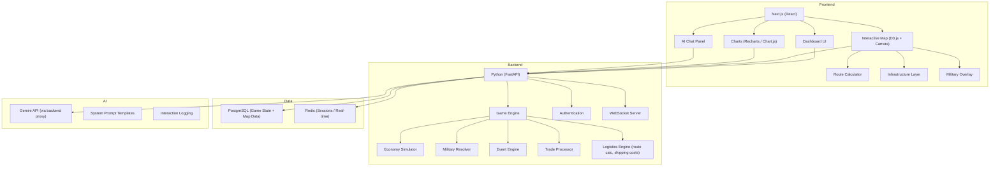

# PangeaWorld Architecture & Instructions


## File Map
The current structure of the PangeaWorld repository:

```
PangeaWorld/
├── PangeaWorld_Implementation_Plan.html / .md (Design & Planning Docs)
├── PangeaWorld_Stakeholder_Presentation.pptx  (Pitch Deck)
├── backend/
│   └── main.py                                (Initial FastAPI backend setup)
└── frontend/
    ├── package.json / vite.config.js          (Vite tooling configuration)
    ├── index.html                             (Vite entry point)
    ├── src/                                   (React source code directory)
    └── public/
        ├── favicon.svg / icons.svg
        └── map_prototype.html                 (Monolithic HTML/JS/CSS Canvas Map Prototype)
```

## Tools Used
- **Map Prototype**: Built entirely with Vanilla JavaScript, HTML5 `<canvas>`, and CSS.
- **Procedural Generation**: Utilizes pure math (composite sine/cosine waves, Voronoi partitioning, and distance calculations) instead of external noise libraries (like Perlin) to generate natural shapes and borders.
- **Frontend Framework**: Scaffolded using Vite and React (for the future application dashboards).
- **Backend Framework**: Scaffolded using Python FastAPI.

## Expected Behaviors
- **Organic Procedural Generation**: The `map_prototype.html` generates a uniquely shaped continent upon every reload. The continent shape is calculated using complex sine waves.
- **Natural Borders**: The 8 countries are divided using a Voronoi diagram based on fixed capital anchor points, enhanced with 2D noise to create squiggly, organic borders.
- **Island Generation**: Zephyria is generated as a distinct island landmass off the coast of the main continent.
- **Interactive Grid**: The map renders an equilateral triangle grid. Players can hover over the edges (which highlight in green/yellow) and click to permanently build railroads.
- **Dynamic Labels**: The country labels (e.g. "Terranova") dynamically position themselves deep within their respective borders based on the procedural shape formula.
- **Zoom Controls**: The sidebar features a "Map Controls" panel with a slider to zoom the canvas in and out, preserving interaction accuracy.

## Architectural Constraints
- **Procedural Generation Freeze**: The mathematical algorithms governing the procedural generation of the map (including the logic for rivers, mountains, coastlines, country boundaries, and cities) are explicitly **locked and finalized**. Do not modify or update these generation algorithms, nor alter the triangle grid rules dictating where railroads can or cannot be built. The map must continue to randomly generate different layouts on each load using the current formulas, but the underlying terrain logic itself must remain untouched.

## Game Rules (As implemented in prototype)
- **Railroad Construction**: Building a standard railroad costs **$1M** per segment.
- **Bridges**: Railroads built over river edges cost **$3M** per segment.
- **Mountain Railroads**: Railroads built on the passible sides of mountains cost **$1.5M** per segment.
- **Impassable Ocean**: Edges touching ocean triangles cannot be built upon.
- **Mountain Mazes**: Mountain generation creates clustered mountain ranges. Crucially, every mountain triangle has **exactly 1 passible edge** (with the other 2 being impassable). This forces players to navigate winding valleys and find specific "passes" through mountain ranges, making logistics a strategic challenge.
- **Dynamic Cost Calculation**: The UI updates the "Total Project Cost" automatically as railroads are placed.

## Applied vs. Not Yet Applied Planned Features

### ✅ Applied Features (Phase 1 Map Foundations)
- **Grid-Based Construction**: The map is successfully divided into a fine grid where presidents "trace the route" line-by-line.
- **Distance & Terrain Costs**: Baseline edge traversal costs are implemented (railroads vs. bridges vs. impassable mountains).
- **8 Nations Geography**: The 8 nations (including Drakmoor and the Zephyria island) are fully defined and geographically distributed.
- **Mountain Ranges**: Distinct, restrictive mountain barriers are implemented.

### ⏳ Not Yet Applied Planned Features (Pending Future Phases)
- **Multiplayer Turn System**: The 48-hour staggered round system (Presidential vs. Company phases) is not yet built.
- **Macro/Micro Economy Engine**: GDP, CPI, inflation, pricing, and company profitability loops are not yet implemented.
- **AI Agent Integration**: The embedded Gemini AI Advisor and the Drakmoor AI antagonist bot are not yet wired up.
- **Dashboards**: The President dashboard, Company Executive dashboard, FMI portal, and UN Assembly chat are pending React implementation.
- **Military Mechanics**: Attack/Defense indices, troop deployments, and intelligence operations are pending.
- **Logistics Math**: The complex "Landed Cost" math (shipping rate × distance × mode multiplier) is pending the routing algorithm layer.


---

# PangeaWorld — Educational Simulation Game Development Plan

> **Reference**: [PangeaWorld Architecture & Instructions](./PangeaWorld_architecture_and_instructions.md)

## Vision & Overview

**PangeaWorld** is a round-based, multiplayer educational simulation that blends the territorial strategy of RISK, the resource economy of CATAN, and the business simulation depth of CAPSIM. Set in a fictitious world of **8 nations** (7 player-controlled + 1 AI-controlled), students assume roles as either **National Presidents** or **Company Executives**, making decisions that ripple across military, economic, and diplomatic systems. The 8th nation, **Drakmoor**, is fully AI-controlled — a marginalized, sanctioned, militarily powerful state that will provoke conflict in the early game, forcing students to deal with the reality that war can happen even when no one wants it. Each user is assisted by an **AI advisor** (Gemini), teaching them to critically evaluate AI-assisted decision-making.

> [!IMPORTANT]
> This is a large-scale project. The plan is structured in **4 major phases** to deliver a working MVP first, then layer in complexity. Each phase is self-contained and playable.

---

## User Review Required

### Naming & Theming
- **"PangeaWorld"** is a working title — do you have a preferred name?
- Should the visual theme lean toward a **stylized/illustrated map** aesthetic (Risk-like), a **clean data-dashboard** feel (Bloomberg terminal), or a **hybrid** with both?

### Deployment & Infrastructure
- Where will this be hosted? University servers, cloud (GCP/AWS/Azure), or a simpler platform like Vercel/Railway?
- How many concurrent students do you anticipate? (This impacts architecture decisions — 50 students vs. 500 is very different)
- Will instructors need a **Game Master (GM) panel** to inject events, pause rounds, and override decisions?

### AI Integration ✅
- **Guardrails**: The Gemini AI advisor will act dynamically based on the game's context. Its advice and analysis will be strictly grounded in the **Pangea Assembly (UN forum) discussions** and the **Pangea Times newsletters**, ensuring it doesn't "hallucinate" external optimal strategies but instead helps students navigate the actual evolving narrative of their specific game.
- **Grading & Logging**: AI usage will be logged and graded as a core learning outcome. Instructors will have visibility into the quantity and quality of student prompts to assess how well they are learning to leverage AI for decision-making.

### Authentication & Access
- Will students log in with university SSO (e.g., Google Workspace, Microsoft Entra), or is a simple email/password system acceptable?
- Should teams be able to self-organize, or does the instructor assign roles?

---

## Confirmed Design Decisions

### 1. Round Duration & Pacing ✅
- **In-Game Timeframe:** Each round represents **1 full year** in Pangea.
- **Staggered 2-Day Rounds (Real Time)** — The 48-hour real-time round is split into two distinct phases to simulate macroeconomic cause and effect. This creates a narrative **6-month delay** between macro policy changes and micro market reactions:
  - **Day 1 (Presidential Phase / First 6 Months):** Presidents analyze data, receive lobbying requests from their companies, and submit their macro decisions (infrastructure, tariffs, military, diplomacy).
  - **Day 2 (Company Phase / Second 6 Months):** Companies react to the new policies set by their president and the global market, locking in their micro decisions (pricing, sourcing, production).
- **Lobbying Mechanic:** During Day 1, companies can submit formal requests to their president for specific resources (e.g., "we need cheaper steel") or infrastructure (e.g., "build a port"). The president's dashboard will aggregate these requests, prioritizing the needs of larger companies that impact GDP the most.
- **7 total rounds** per game (14 calendar days for a full game, representing 7 years in Pangea)
- **Asynchronous** — decisions are submitted like homework, not live in class. The engine processes once the Day 2 deadline passes
- Class time can be used for debriefing, strategy discussion, and connecting game events to real-world examples

### 2. Player Scale ✅
- **2-4 students per company team**
- 10-15 companies × 7 player nations = 70-105 company teams + 7 presidents
- Unfilled slots backfilled by AI bots (see Phase 2)

### 3. Win Conditions & Scoring ✅
**No elimination** — all nations and companies play all 7 rounds regardless of performance.

> [!TIP]
> ### Balanced Evaluation (Proportional + Absolute)
> Because nations start with asymmetric resources and geographic advantages (e.g., Lunara's high baseline costs vs. Valdoria's resource wealth), scoring evaluates a **balance of both proportional growth AND absolute raw values**. 
> - **Proportional Growth** measures who managed their resources best relative to their starting position.
> - **Absolute Values** represent the sheer scale and dominance achieved in the global market.
> Winning requires a combination of smart incremental management and achieving massive scale.

**Company Scorecard** (CAPSIM-style round report):

| KPI | Description |
|:---|:---|
| **Net Profit (Absolute & Relative)** | Raw profit value + evaluated against baseline expectations |
| **Market Share (Absolute & Growth)** | Total % of market owned + round-over-round % change |
| **Revenue (Absolute & Growth)** | Total revenue generated + round-over-round % increase |
| **Gross Margin** | (Revenue - COGS) / Revenue — measures pure operational efficiency |
| **Return on Assets (ROA)** | Net income / total assets — measures how well they use what they have |
| **Cash Position** | Available cash after obligations (absolute) |
| **Supply Chain Efficiency** | Landed cost vs. competitors sourcing the same resources |
| **Customer Satisfaction** | Composite of price competitiveness, product quality, and availability |

**President Scorecard:**

| KPI | Description |
|:---|:---|
| **GDP (Absolute & Growth)** | Total national GDP + round-over-round % change |
| **Inflation (CPI Stability)** | How well the president managed inflation/deflation relative to their nation's baseline |
| **Unemployment (Absolute & Change)** | Current unemployment % + the % reduction or increase |
| **Trade Balance** | Total value of exports vs. imports |
| **Infrastructure Index** | Quality and coverage of railroads, ports, and routes |
| **Debt-to-GDP Ratio** | FMI debt relative to GDP — lower is healthier |
| **Diplomatic Standing** | Number of active trade agreements, alliances, and sanctions (for/against) |
| **Military Readiness** | Total defensive capability + capability relative to active threats |
| **National Approval Rating** | Composite score simulating citizen satisfaction with the president's leadership |

**Drakmoor Targeting the Leader:**
- Drakmoor's AI factors in **who is currently winning** when making decisions
- The leading nation/company may attract Drakmoor's attention — trade disruptions, hostile diplomacy, or even military targeting
- This adds a "rubber-band" mechanic that prevents runaway leaders and keeps the game competitive
- However, Drakmoor is careful about attacking militarily strong nations — it prefers economically dominant but militarily weak targets

**Auto-Decision Penalty:**
- If a team **does not submit decisions** by the 48-hour deadline, the engine applies **auto-decisions**
- Auto-decisions are intentionally **suboptimal** — conservative pricing, no R&D investment, no supply chain adjustments, no diplomatic actions
- This serves as a **penalty for inactivity** — your company/nation falls behind if you don't engage
- The Pangea Times may report: *"[Company X] appears to be on autopilot this quarter..."*
- Presidents who skip a round default to status-quo policies with no military actions and abstain on sanctions votes

### Project & Operation Timelines (Deployment Speed vs. Cost)
When presidents deploy major projects, sweeping decisions, or military operations, they must choose a deployment timeframe ranging from 1 to 3 rounds. This forces a strategic trade-off between speed, financial cost, and secrecy:

| Timeframe | Cost Multiplier | Intel Vulnerability | Description |
|:---|:---|:---|:---|
| **1 Round** (Rush) | 5x Normal Price | Immune to Interception | Executed immediately with maximum secrecy, but financially devastating. Foreign intel cannot intercept 1-round decisions before they happen. |
| **2 Rounds** (Standard) | 2x Normal Price | Moderate Vulnerability | Executed with moderate urgency. There is a chance foreign spies might uncover the plans during the intermediate round. |
| **3 Rounds** (Long-term) | 1x Normal Price | High Vulnerability | The most cost-effective option, requiring long-term planning. Because the operation develops over 3 years, it is highly susceptible to being discovered by rival intelligence networks before execution. |

- This mechanic teaches that **fast execution requires massive capital** and that **secrecy has a steep price**.
- The likelihood of rival nations finding out about a pending operation increases significantly as the timeframe increases.

### 4. Resource Types ✅
Six resource categories confirmed:
- **Energy** (oil, natural gas, renewables)
- **Minerals** (metals, rare earths)
- **Agriculture** (food, livestock)
- **Technology** (R&D output, patents)
- **Labor** (population, education level)
- **Capital** (financial markets, banking)
- Resources **deplete gradually** over time, teaching sustainability and forcing nations to adapt

### 5. Military Mechanics Depth ✅ — Medium
- Students choose **unit types** (infantry, navy, air force) and deploy them on the map
- **Supply lines matter** — troops far from borders cost more to maintain
- **Intelligence operations** — spend budget to spy on other nations. This can randomly uncover secret information, such as intercepted lobbying requests from foreign companies to their presidents, helping players deduce rival nations' long-term economic or military plans. **Note: Nations are fully protected from all espionage and sabotage during Rounds 1 and 2**, giving them a grace period to build their economies. However, presidents can begin investing in their intelligence capabilities starting in Round 1 to prepare for Round 3.
- **Covert Sabotage** — When resources are scarce, rival nations building infrastructure (e.g., railroads) to shared resource nodes will drive up your costs. Presidents and companies can fund covert sabotage to destroy this competing infrastructure. Success is randomized (resolved with Attack Index / Defense Index) and depends on both the attacker's and defender's intelligence capabilities, which can be upgraded through investments. If caught, the FMI automatically sanctions the aggressor for 1-2 rounds.
- **False Flag Attacks (Round 5+)** — Companies with high intelligence/military investments can orchestrate false flag attacks starting in Round 5. Success is randomized and odds scale with their investment level. If successful, the framed nation takes the blame and faces immediate international sanctions. If discovered (failed roll), the executing company and their home nation face severe FMI sanctions and diplomatic isolation.

**Combat Resolution — Attack Index vs. Defense Index:**

Each nation has two military indices that grow with investment:

| Index | Components |
|:---|:---|
| **Attack Index (ATK)** | Offensive units (infantry, navy, air) + technology level + supply line proximity + intelligence intel |
| **Defense Index (DEF)** | Defensive units + fortifications + terrain bonus + infrastructure quality |

The index determines **how many dice** each side rolls:

| Index Level | Dice Rolled | Example Investment Level |
|:---|:---|:---|
| 1–2 | 1 die | Minimal military, no tech investment |
| 3–4 | 2 dice | Moderate standing army |
| 5–6 | 3 dice | Well-funded military with tech |
| 7–8 | 4 dice | Major military power |
| 9–10 | 5 dice | Superpower-level force projection |

**Tie-breaking rule:** When the highest dice are compared, **ties go to whichever side has the higher index** (ATK or DEF). This means a nation with ATK 7 that ties with a nation at DEF 5 wins the tie. Investing in your index gives a subtle but powerful edge.

**Quarterly Campaign Cycle & Conditional Orders:**
- Wars are not resolved in a single instant. An attack order initiates a **year-long campaign** (1 round = 1 year) that resolves in **quarterly phases (every 3 months)**.
- **Conditional Orders (If/Then):** Presidents can issue logical conditionals for their campaigns (e.g., "If we haven't secured the territory by the 6-month mark, halt the attack and retreat" or "If our casualties exceed 30%, stop"). This adds strategic depth to military planning.
- **Campaign End Conditions:** Troops will continue to attack each quarter until either the territory/objective is fully conquered, the attacking force is depleted/lost for the year, or a conditional order halts the offensive.
- **Mid-Year War Report:** Since Presidents lock in their attack policies on Day 1 (Month 1), the first two quarters of the campaign are resolved by the engine *before* companies make their Day 2 (Month 7) decisions.
- This gives companies crucial intelligence on how the war is progressing (e.g., "Our forces are stalled" or "The enemy port has been captured") so they can adjust their supply chains and pricing accordingly for the second half of the year.

**Key implications:**
- **War is Unpopular:** Starting an offensive war significantly lowers a president's Approval Rating. The game remains fundamentally an educational business simulation, not a war game. Military is a calculated geopolitical tool, not a default strategy.
- A nation with ATK 2 (1 die) attacking a nation with DEF 6 (3 dice) is near-suicidal — the defender compares 3 dice to 1
- A nation with ATK 8 (4 dice) vs. DEF 4 (2 dice) has overwhelming advantage + wins all ties
- Even at equal dice, the higher-index nation has the tie-breaking edge
- Indices grow through **sustained investment over multiple rounds** — you can't build a superpower military overnight
- This teaches that military capability is a long-term strategic investment, not a last-minute panic buy

- War is costly — military spending directly reduces economic investment capacity
- Ties into supply chain, budgeting, and opportunity cost lessons

### 6. Trade & Diplomacy ✅ — Full Feature Set
- **Alliances**: Presidents can formally ally (shared military defense, preferential trade rates, joint sanctions voting)
- **Trade defaults allowed**: Nations can break deals — the game engine does NOT enforce contracts. This teaches contract risk, trust, and the importance of enforceable international agreements
- **UN-style forum ("Pangea Assembly")**: A public chat space where all 8 presidents (including Drakmoor) can make speeches, propose resolutions, negotiate deals, and posture. All messages are logged and visible to the instructor

---

## Suggested Additional Course Connections

Based on your framework, here are courses that naturally map to PangeaWorld mechanics:

| Course | Game Mechanic |
|:---|:---|
| **International Affairs** | Diplomacy, alliances, sanctions, war declarations, UN-style forum |
| **International Business** | Cross-border trade, tariffs, currency exchange, FDI decisions |
| **Supply Chain Management** | Resource sourcing, logistics routes, disruption events (port closures, weather) |
| **Macroeconomics** | CPI, GDP, inflation, monetary policy, interest rates, unemployment |
| **Finance** | Company valuation, stock prices, debt/equity decisions, ROI |
| **Marketing** | Product positioning, pricing strategy, market share competition |
| **Data Analytics** | Dashboard interpretation, KPI analysis, forecasting |
| **Ethics & Corporate Responsibility** | Environmental impact, labor conditions, corruption mechanics |
| **Negotiation** | Trade deals, alliance formation, conflict resolution |
| **Political Science** | Government types, policy decisions, public approval ratings |

---

## Proposed Changes

### Phase 1 — Foundation & World Building (MVP)
> Goal: Playable single-nation prototype with core economy loop

---

#### Game Engine & Data Model

##### [NEW] Core simulation engine
- **Round Manager**: Controls game state transitions (submission → processing → results)
- **Economy Engine**: Calculates GDP, CPI, inflation, trade balances per nation
- **Resource Engine**: Manages production, consumption, trade flows, and scarcity
- **Event Engine**: Injects world events (weather, political crises, market shocks)

##### [NEW] Data schema design

```
World
├── Map
│   ├── Nations (8 territories with borders & geography)
│   ├── Infrastructure
│   │   ├── Railroads (inter-city, inter-nation — cost per unit distance)
│   │   ├── Rivers (navigable waterways — moderate shipping cost)
│   │   ├── Ports (coastal access points for sea shipping)
│   │   ├── Sea Lanes (cheapest long-distance routes between ports)
│   │   ├── Airports (emergency/premium freight only)
│   │   └── Chokepoints (straits, canals — can be blockaded)
│   └── Routes (precomputed paths between resource nodes)
├── Nations (8 — 7 player + 1 AI)
│   ├── President (user or AI agent for Drakmoor)
│   ├── Confidential Intel Vault (isolated database/table)
│   │   ├── Secret military deployments & covert operations
│   │   ├── Private company lobbying requests
│   │   └── ONLY accessible to the President; leaks ONLY via enemy spy activity
│   ├── Resources (production rates, stockpiles, geographic location on map)
│   ├── Military (budget, units, deployments on map)
│   ├── Economy (GDP, CPI basket, inflation, unemployment)
│   ├── Infrastructure (railroads, ports, bridges — investable & destructible)
│   ├── Policies (tax rates, tariffs, subsidies)
│   └── Companies (10-15 per nation)
│       ├── Team (users)
│       ├── Financials (revenue, costs incl. shipping, profit, cash)
│       ├── Supply Chain (sourcing routes on map, shipping mode, costs)
│       ├── Products (price incl. logistics markup, quality, market share)
│       └── Decisions (per-round submissions)
├── Global Market
│   ├── Commodity Prices
│   ├── Exchange Rates
│   ├── Trade Agreements
│   └── Shipping Rate Index (fluctuates with fuel prices & disruptions)
├── Rounds
│   ├── Round Number
│   ├── Status (planning / submitted / processing / complete)
│   ├── Events (injected scenarios)
│   └── Results (per-nation, per-company snapshots)
├── Global Ledger (AI Knowledge Base)
│   ├── Every public user decision (pricing, sourcing, public military, R&D)
│   ├── Every diplomatic action (proposals, FMI votes, rejected treaties)
│   ├── Every event & disaster (major and minor)
│   ├── Every news article and Pangea Assembly chat message
│   └── Note: AI is strictly partitioned from the Confidential Intel Vaults and cannot leak secrets unless a spy operation officially succeeds.
└── News Feed
    ├── System-generated articles
    ├── Event announcements
    └── Market reports
```

---

#### Frontend — Company Dashboard

##### [NEW] Company executive dashboard
- **Financial Overview**: Revenue, COGS (incl. shipping costs breakdown), gross margin, net profit, cash position (charts + tables)
- **Sourcing Module**: Executives select a required resource and view a live marketplace of suppliers (both user-run and bot companies). The interface displays the base price + available shipping modes + transit times = **Total Landed Cost**.
- **Supply Chain Map**: Interactive map showing chosen sourcing routes. Routes highlighted in green (active), yellow (at risk), red (disrupted)
- **Virtual Consumer Market (Sales)**: Companies set their final product prices in a competitive virtual market. They compete for market share against other user teams AND automated bot companies.
- **Market Position**: Market share vs. competitors, product pricing comparison, and consumer demand curves.
- **Decision Panel**: Per-round input forms for pricing, production volume, R&D investment, and **sourcing route/supplier selection**.
- **News Feed**: "Pangea Times" — AI-generated news articles reflecting world events
- **AI Advisor Panel**: Embedded Gemini chatbot with company-specific context

##### [NEW] President dashboard
- **National Overview**: GDP, CPI breakdown (product-by-product), unemployment rate, trade balance, **FMI debt status**
- **Intelligence Panel**: Reports on other nations' public data + purchased intel
- **Military Command**: Troop deployment map, budget allocation, operation planning
- **Diplomacy Center**: Active treaties, trade agreements, pending proposals, **sanctions voting panel**
- **FMI Portal**: Apply for loans, view repayment schedule, monitor credit rating, and **allocate budget to FMI contributions** (which increases borrowing capacity)
- **Policy Controls**: Tax rates, tariffs, subsidies
- **AI Advisor Panel**: Embedded Gemini chatbot with nation-specific context

---

#### The Pangea World Map & Logistics System

##### [NEW] Interactive world map
The map is the **centerpiece** of PangeaWorld — a fictional continent where all 8 nations are positioned with realistic geography:

```
                    ┌─────────────┐
              ╔═════╡   NORDVIK   ╞══════╗
              ║     │  (arctic)   │      ║
              ║     └──────┬──────┘      ║
         ┌────╨───┐   river│        ┌────╨────┐
         │VALDORIA│◄───────┤        │DRAKMOOR │
         │(desert/│  railroad  │        │(mountain│
         │ oil)   ├────────┤        │ fortress│
         └───┬────┘   ┌────┴────┐   └────┬────┘
        port │        │KORVATH  │        │ railroad
     ~~~~~~~~│~~~~~~~~│(industr)│~~~~~~~~│~~~~~~~~~
     ~ SEA ~ │  port  └────┬────┘  port  │ ~ SEA ~
     ~~~~~~~~│~~~~~~~~~~~~~│~~~~~~~~~~~~~│~~~~~~~~~
         ┌───┴────┐   railroad │        ┌────┴────┐
         │SOLHAVEN│◄───────┤        │ZEPHYRIA │
         │(finan- │        │        │(trade   │
         │ cial)  │   ┌────┴────┐   │ hub)    │
         └────────┘   │TERRANOVA│   └─────────┘
                      │(agricul)│
              ~~~~~~~~┴─────────┴~~~~~~~~
              ~    LUNARA (island)      ~
              ~~~~~~~~~~~~~~~~~~~~~~~~~~~
```

> [!NOTE]
> This is a simplified layout — the actual game map will be a beautifully rendered interactive visualization. The key point is that **geography determines logistics costs and trade routes**.

##### [NEW] Infrastructure types

| Infrastructure | Description | Shipping Cost | Speed |
|:---|:---|:---|:---|
| **Sea Lanes** 🚢 | Ocean routes between ports | **~$2/unit** (cheapest) | Slow (2-3 days/round) |
| **Rivers** 🛥️ | Navigable waterways within/between nations | **~$5/unit** | Moderate |
| **Railroads** 🚛 | Overland freight routes | **~$12/unit** (most expensive) | Fast (1 day/round) |
| **Air Freight** ✈️ | Emergency/premium cargo only | **~$30/unit** | Instant |

> [!IMPORTANT]
> **Oil Transportation Rule:** Oil cannot be transported by air freight. It must be transported by sea or railroad.

- Costs scale with **distance** (number of map segments traversed)
- Sea shipping requires both origin and destination to have **port access**
- Landlocked nations (like Drakmoor) pay premium railroad costs unless they negotiate port access through neighbors
- Rivers are only available along specific geographic features — not every nation pair has a river connection

##### [NEW] Logistics cost model
Shipping cost is factored into every trade and sourcing decision:

```
Landed Cost = Base Commodity Price
            + (Shipping Rate × Distance × Mode Multiplier)
            + Tariffs (if crossing borders)
            + Insurance (higher in conflict zones)
            + Port/Transit Fees
```

**Example scenario:**
> A company in Solhaven needs steel. Options:
> - **Korvath** (nearby, has port): $50/unit steel + $4 sea shipping = **$54 landed**
> - **Nordvik** (far, no direct sea): $45/unit steel + $36 railroad shipping = **$81 landed**
> - **Drakmoor** (sanctioned, cheap steel): $30/unit steel + $24 railroad... but sanctions block the trade entirely
>
> If war disrupts the Korvath sea lane, suddenly Nordvik's $81 becomes the only option — and every company in Solhaven sees margins collapse.

##### [NEW] Infrastructure Construction & Strategic Assets
- **Grid-Based Construction**: The map is divided into a fine **triangular grid**. When Presidents invest in new railroads, they don't just click a button — they physically **trace the route** line-by-line across the triangles.
- **Distance, Terrain Costs & Timeframes**: The cost of railroads depends heavily on the length of the traced route. Furthermore, construction is not instant. When planning a route, the system calculates a **construction timeframe** based on distance and terrain (e.g., 6 months [0.5 rounds], 1 year [1 round], 1.5 years, 2 years). Presidents must weigh this time delay when deciding whether to build a long railroad vs. utilizing existing routes.
- **Mountain Ranges**: The map features impassable or highly restrictive mountain ranges. These natural barriers make railroad-building incredibly difficult, forcing presidents to either build long, expensive routes *around* the mountains or rely on premium air freight infrastructure.
- **River Crossings (Bridges)**: If a traced railroad crosses a river tile, a bridge must be built. Bridges cost **3x the price** of a normal railroad segment.
- **Airports & Hubs**: Airports are located exclusively in the largest cities (cities spanning 2 triangles). These large cities serve as the major logistics hubs for their respective countries.
- **Port City Placement**: Each country starts with two port cities located on their coastline. To optimize distribution and strategic viability, ports are automatically placed at the 1/3 and 2/3 marks along the coastline between the country's borders. Ports are strictly forbidden from spawning within 2 triangles of another country's border, within 3 triangles of an impassable mountain range, or on tiles entirely enclosed by mountains. (Lunara is an exception, having a dedicated 2-3 triangle thick mountain range on its southern coast, and its ports clustered specifically on the Strait of Lunara).
- **Starting Railroad Networks**: At the start of the game, every small city (1-triangle) is automatically connected to its nearest large city/airport hub via pre-built railroad networks. The paths are algorithmically plotted to avoid impassable terrain and minimize the number of expensive river crossings.
- **Destructible Assets**: War can destroy infrastructure. Enemies can bomb bridges (severing vital railroad connections), blockade ports, and mine sea lanes.
- **Strategic Chokepoints**: Straits and canals can be blockaded by naval forces, disrupting trade for multiple nations simultaneously.
- **Zephyria's Advantage**: Positioned as a crossroads with flat terrain and access to multiple routes, making it a natural trade hub (but also a prime military target).

---

#### The 8 Nations of Pangea

##### [NEW] Nation design document
Each nation is designed to mirror real-world archetypes without mapping 1:1 to any real country, following the guidelines:

| Nation | Archetype | Key Resources | Economic Profile |
|:---|:---|:---|:---|
| **Valdoria** | Resource-rich, politically complex | Oil, natural gas, minerals | High commodity exports, developing manufacturing |
| **Lunara** 🏝️ | Isolated island nation (Iceland-like) | Highest oil production, technology, fisheries, renewable energy | High-skill economy, **no land connections** — all trade by sea/air |
| **Terranova** | Agricultural powerhouse | Grain, livestock, timber, freshwater | Food exporter, growing middle class |
| **Korvath** | Industrial manufacturing hub | Steel, chemicals, labor | Export-driven manufacturing, trade surplus |
| **Solhaven** | Financial & services center | Capital, banking, insurance | Financial hub, low resources, high GDP per capita |
| **Nordvik** | Northern resource frontier | Rare earth minerals, timber, oil | Rich resources, harsh climate, small population |
| **Zephyria** | Emerging market crossroads | Mixed moderate resources, strategic location | Trade route hub, rapid urbanization, young population |
| **Drakmoor** 🤖 | Marginalized military state (AI-controlled) | Iron, coal, weapons manufacturing | Sanctioned economy, strong military, isolated, desperate |

> [!NOTE]
> Each nation is intentionally designed with **asymmetric advantages and vulnerabilities** to force trade and diplomacy. No nation can be self-sufficient — this is a core design principle that teaches interdependence.

> [!WARNING]
> ### 🏝️ Lunara — The Island Struggle
> Lunara has **no land borders** with any other nation. Like Iceland, this creates unique challenges:
> - **All imports arrive by sea or air** — no cheap railroad/river options. Minimum shipping cost is ~$2/unit (sea) vs. $0 for neighbors trading overland
> - **Food insecurity** — Lunara has fisheries but no agriculture. It must import grain, livestock, and timber from the mainland at premium shipping costs
> - **Vulnerable to naval blockade** — if a hostile nation (e.g., Drakmoor) blockades Lunara's ports, the entire economy grinds to a halt
> - **Weather disruptions** — storms can temporarily shut down sea lanes to Lunara, cutting off supplies for 1-2 rounds
> - **High cost of living** — imported goods drive up consumer prices, making Lunara's CPI naturally higher than mainland nations
> - **Compensating strengths** — Lunara's technology exports and renewable energy are highly valued, and its island position makes it hard to invade by land. Its educated workforce commands premium prices for tech and services
>
> This mirrors real-world island economies (Iceland, Japan, Singapore, New Zealand) that must navigate the constant tension between geographic isolation and global trade dependency.

---

#### 🤖 Drakmoor — The AI-Controlled Antagonist Nation

Drakmoor is the **8th nation**, fully controlled by an AI agent (not played by students). It serves critical educational purposes:

**Backstory & Context:**
- Drakmoor was once a prosperous industrial power but has been **marginalized by international sanctions** due to authoritarian governance and aggressive posturing
- Its economy is suffering — limited access to global markets, rising unemployment, crumbling infrastructure
- However, it has maintained a **disproportionately strong military** (spending 40%+ of GDP on defense)
- Its AI-driven leadership grows increasingly desperate and nationalistic as sanctions bite harder each round

**Behavioral Programming — Randomized Per Game Instance:**

At the start of each new game, Drakmoor's AI agent rolls a **randomized profile** so that no two games play out the same way. Students who replay the game cannot assume Drakmoor's behavior:

| Randomized Element | Possible Values |
|:---|:---|
| **Primary Motivation** | Resource hunger (targets resource-rich nations), territorial expansion (targets neighbors), ideological rivalry (targets the most prosperous nation), revenge (targets whoever led the sanctions) |
| **Target Nation** | Any of the 7 player nations — weighted by proximity and motivation (e.g., attacks Korvath for steel in one game, Lunara for technology in another, Terranova for food in another) |
| **Aggression Timeline** | War initiation randomly falls between rounds 2-5; pre-war diplomacy length varies |
| **Diplomatic Personality** | Cold & calculating, erratic & unpredictable, publicly aggressive, or deceptively friendly before striking |
| **War Strategy** | Blitzkrieg (fast, concentrated attack), war of attrition (slow escalation), proxy conflict (funds instability in target nation first), or naval blockade |
| **Post-War Behavior** | Seeks peace if losing, doubles down if winning, fragments into civil war, or pivots to a new target |

- **Round 1**: Drakmoor always begins with diplomatic overtures — but the *tone* varies (friendly trade proposals vs. threatening demands). It **actively seeks alliances** with player nations, offering cheap resources, military cooperation, or favorable trade terms
- **Rounds 2-5**: War is initiated based on the rolled timeline. The buildup includes escalating news events, troop movements reported in the Pangea Times, and rejected ultimatums. Drakmoor will vote against any sanctions targeting itself or its allies in the FMI
- **Alliance strategy**: Drakmoor specifically targets nations that are economically struggling or diplomatically isolated — offering them a lifeline that comes with international consequences. Any nation that aligns with Drakmoor risks sanctions from the other nations and reduced FMI lending access
- **Post-war**: Behavior adapts dynamically based on both the randomized profile AND the actual outcomes
- The instructor can view (but students cannot see) Drakmoor's rolled profile for the current game via the GM panel

**Educational Purpose:**
- Forces students to deal with **geopolitical instability they didn't cause**
- Teaches that sanctions have consequences (pushing nations toward desperation)
- Creates urgency for military preparedness, intelligence gathering, and alliance formation
- Shows how war disrupts supply chains, trade routes, and commodity prices for ALL nations — even those not directly involved
- Mirrors real-world scenarios where conflict emerges from marginalization and economic isolation

> [!IMPORTANT]
> Drakmoor's actions should generate **ripple effects** across the entire game world:
> - Commodity prices spike (especially energy, metals)
> - Trade routes through conflict zones are disrupted
> - Nations must choose sides or stay neutral (diplomatic pressure)
> - Companies face supply chain disruptions and must find alternative sourcing
> - The "Pangea Times" news feed covers the crisis extensively

---

### Phase 2 — Multiplayer & Round System

##### [NEW] Drakmoor AI agent
- AI decision engine with weighted randomization for diplomatic and military actions
- Configurable aggression timeline (default: war between rounds 2-5)
- Instructor override capability (GM can adjust Drakmoor's behavior mid-game)
- Drakmoor's actions generate automatic news articles and market disruption events

##### [NEW] Authentication & session management
- User registration with role assignment (President vs. Company Executive)
- Team formation and nation assignment
- **Customization (Round 1):** Users have the option to change their assigned Nation's name or Company's name during the first round to increase team identity and ownership. **Strict content moderation filters** will block offensive, profane, or blasphemous names to maintain a professional educational environment.
- Session management for concurrent games

##### [NEW] AI bot backfill system
If there aren't enough students to fill all roles, **AI bots automatically fill empty slots** so the game world always runs at full capacity:

**How it works:**
- The instructor sets up a game and assigns students to nations/companies
- Any **unfilled president seat** is run by an AI bot (similar to Drakmoor, but non-antagonistic — plays as a rational, moderate leader)
- Any **unfilled company slot** is run by an AI bot that makes reasonable business decisions (competitive but not dominant)
- AI bots are clearly labeled in the UI with a 🤖 icon so students know which actors are human vs. AI

**AI Bot Difficulty Levels:**

| Level | Behavior | Best For |
|:---|:---|:---|
| **Passive** | Makes safe, conservative decisions — easy to outcompete | Small classes, introductory courses |
| **Balanced** | Makes competent decisions — realistic competition | Standard gameplay |
| **Aggressive** | Plays to win — challenges students to perform | Advanced courses, experienced students |

**Scaling scenarios:**

| Class Size | Setup |
|:---|:---|
| **200+ students** | All 7 nations fully student-run, no bots needed |
| **100-200 students** | 4-5 student nations, 2-3 AI-run nations with AI companies |
| **50-100 students** | 2-3 student nations, rest AI-run; fewer companies per student nation |
| **20-50 students** | 1-2 student nations, rest AI-run; students focus on company roles |
| **< 20 students** | 1 student nation (all students are company execs + 1 president), 6 AI nations |

- The instructor can **swap a bot for a student** mid-game (e.g., a late-joining student takes over an AI company)
- AI bots submit decisions automatically during the submission phase — no waiting
- Bot-run nations still participate in **sanctions votes, trade proposals, and FMI lending** — creating a living world regardless of class size

> [!NOTE]
> This means PangeaWorld works for a class of 10 students or 300 students. The game world always has 8 nations, 80-120 companies, trade, diplomacy, and conflict — the only variable is how many of those actors are human.

##### [NEW] Round lifecycle system
```
┌─────────────┐     ┌────────────────┐     ┌────────────────┐     ┌─────────────┐     ┌──────────────┐
│  PLANNING   │────▶│ DAY 1: PRES.   │────▶│ DAY 2: COMPANY │────▶│ PROCESSING  │────▶│   RESULTS    │
│  Phase      │     │ Deadline       │     │ Deadline       │     │ Engine      │     │  & Debrief   │
│             │     │                │     │                │     │ Calculates  │     │              │
│ • Review    │     │ • Companies    │     │ • Policies &   │     │ • Economy   │     │ • Updated    │
│   results   │     │   lobby Pres.  │     │   Tariffs lock │     │ • Military  │     │   dashboards │
│ • Analyze   │     │ • Presidents   │     │ • Companies    │     │ • Events    │     │ • News feed  │
│   data      │     │   set macro    │     │   submit micro │     │ • Trade     │     │ • Rankings   │
│ • Consult   │     │   policy       │     │   decisions    │     │ • Results   │     │ • AI debrief │
│   AI        │     │                │     │                │     │             │     │              │
└─────────────┘     └────────────────┘     └────────────────┘     └─────────────┘     └──────────────┘
```

##### [NEW] Trade & diplomacy system
- Proposal/acceptance workflow for trade deals
- Treaty templates (mutual defense, trade agreements, non-aggression pacts)
- Tariff mechanics (set per nation, per product category)
- Public vs. secret negotiations

##### [NEW] Fundo Monetário Internacional (FMI)
The FMI is a **multilateral financial institution** — the game's equivalent of the IMF — that provides loans to nations and enforces financial discipline:

**Lending Products:**

| Loan Type | Purpose | Terms | Conditions |
|:---|:---|:---|:---|
| **Emergency Credit** | Short-term liquidity crisis (can't pay military, infrastructure) | 1-2 rounds, high interest (8-12%) | Must be repaid quickly or credit rating drops |
| **Development Loan** | Long-term infrastructure, education, industrialization | 4-6 rounds, moderate interest (3-6%) | Requires reform commitments (e.g., reduce military spend) |
| **Bailout Package** | Nation on verge of economic collapse | Full game duration, low interest (1-3%) | Severe conditions: austerity, privatization, oversight |

**Lending Limits:**
- Each nation has a **credit allowance** based on GDP, debt-to-GDP ratio, international standing, and **most importantly, their direct financial contributions (quotas) to the FMI**. Presidents can invest national budget into the FMI to increase this limit.
- Nations under sanctions have **reduced FMI allowances** — less access to cheap capital
- Nations allied with Drakmoor face **further FMI restrictions** — the international community penalizes alignment with a sanctioned state
- **Automatic Sabotage Penalties**: If a nation or its companies are caught conducting covert sabotage, the FMI automatically freezes their credit access and imposes strict sanctions for 1-2 rounds
- Defaulting on FMI loans triggers automatic credit downgrades and trade penalties

**Educational Purpose:**
- Teaches how international financial institutions influence national policy
- Shows the tension between sovereignty and financial dependency
- Demonstrates how debt can constrain a nation's freedom of action
- Mirrors real-world IMF conditionality debates

##### [NEW] Sanctions voting system
Sanctions are **not automatic** — they require a democratic vote among all 8 presidents (including Drakmoor):

- Any president can **propose sanctions** against another nation (trade embargo, asset freeze, FMI restrictions)
- All 8 presidents vote: **simple majority (5 of 8)** passes a sanction
- Drakmoor gets a vote too — it will vote strategically (e.g., voting against sanctions on its allies)
- **Sanction types:**
  - 🚫 **Trade Embargo**: Blocks specific commodity trade with the sanctioned nation
  - 🏦 **Financial Sanctions**: Reduces the nation's FMI credit allowance by 30-50%
  - ⚓ **Shipping Restrictions**: Other nations' ports cannot service the sanctioned nation's cargo
  - 🔒 **Full Isolation**: Combination of all above (requires supermajority: 6 of 8)
- Sanctions can be **lifted** by a new vote (same majority threshold)
- **Consequences of aligning with Drakmoor**:
  - If a player nation votes consistently with Drakmoor or signs alliance/trade deals with it, other nations may propose sanctions against *them*
  - Their FMI credit allowance is reduced proportionally to the depth of the alliance
  - This creates a **diplomatic trap**: Drakmoor may offer cheap iron, coal, or military support, but accepting it risks international isolation

> [!IMPORTANT]
> The sanctions voting system teaches that **international pressure is a political process, not a rule of nature**. Students learn that sanctions require coalition-building, and that sanctioned nations still have agency (they can seek allies, circumvent restrictions, or retaliate).

---

### Phase 3 — Military, Events & News

##### [NEW] Military operations system
- Unit types: Infantry, Navy, Air Force (each with cost and capability)
- Operations: Attack, Defend, Blockade, Intelligence Gathering
- **Resolution: Attack Index vs. Defense Index** — each nation's ATK and DEF indices determine how many dice they roll (1–5 dice scaled by index level 1–10). Ties are won by the higher index. This replaces fixed RISK dice counts with a dynamic system that rewards sustained military investment. Outcomes remain randomized — war is unpredictable, but preparation matters.
  - Multiple engagement rounds per battle, with the option to retreat
  - Indices grow through sustained investment over multiple rounds (infantry, navy, air force, technology, fortifications, intelligence)
  - This teaches that **military capability is a long-term strategic investment**, not a panic buy
- Costs: Military spending directly reduces money available for economic investment (teaching opportunity cost)
- **War ripple effects**: Active conflicts disrupt trade routes, spike commodity prices, and trigger refugee/humanitarian events

##### [NEW] Dynamic event engine
- **Instructor-triggered events**: GM panel to inject custom scenarios
- **Scheduled events**: Pre-programmed events tied to round numbers
- **Reactive events**: Triggered by game state (e.g., if a nation's CPI exceeds 115, trigger "civil unrest")
- **Frequency & Scale**: A standard game contains **3 major events** (massive disruptions) and **10-12 minor events** randomly distributed throughout the game. Minor events usually require financial investments to rebuild or recover.
- Event categories:
  - 🌪️ Natural disasters & Hazards (earthquakes, twisters, hurricanes, tsunamis, oil leakages, droughts)
  - 📰 Political crises (coups, elections, protests)
  - 📈 Market shocks (commodity price spikes, financial crises)
  - 🦠 Health emergencies (pandemics, supply disruptions)
  - 🔬 Technology breakthroughs (new resource discovery, innovation)

##### [NEW] "Pangea Times" news system
- AI-generated news articles reflecting game events in journalistic style
- Market reports with charts and data
- Opinion pieces that introduce bias (teaching media literacy)
- Some articles contain **deliberate misinformation** (teaching source verification)

---

### Phase 4 — AI Integration & Analytics

##### [NEW] Gemini AI advisor integration
- Per-user chat interface with persistent conversation history
- **Global Event Ledger (Knowledge Base)**: The game maintains a complete, immutable ledger of every action, disaster, decision, deal, rejected proposal, and news event. The AI advisor queries this ledger to provide context-aware advice grounded in the exact history of the current game instance.
- **System prompt engineering**:
  - Company advisors: Knowledgeable about business strategy, supply chain, finance
  - President advisors: Knowledgeable about macroeconomics, geopolitics, military strategy
  - Both: Will NOT give direct answers — uses Socratic method to guide thinking
  - Both: Has access to the user's game data for contextual advice
- **AI usage logging**: Track all AI interactions for instructor review
- **Guardrails**: AI cannot reveal other players' secret decisions or provide optimal solutions

##### [NEW] Instructor analytics dashboard
- Per-student engagement metrics (decisions made, AI usage, login frequency)
- Learning outcome tracking (did decision quality improve over rounds?)
- Game balance monitoring (is one nation too dominant?)
- Export functionality for grades and reports

##### [NEW] Post-game debrief tools
- Historical playback of all rounds
- "What-if" analysis (what would have happened if X decision was different?)
- Connection to real-world examples: "Your nation experienced Y — here's when that happened in the real world"

---

## Technical Architecture

### Recommended Stack



### Why This Stack?
- **Backend (Python + FastAPI)**: FastAPI is lightning-fast, uses modern Python type hints (Pydantic), and is ideal for complex game logic, mathematical simulations, and AI integrations.
- **Frontend (React + Vite)**: A decoupled React single-page application built with Vite provides a fast, interactive user experience for the complex dashboards.
- **PostgreSQL**: Complex relational data (nations, companies, rounds, decisions) demands a relational DB
- **Redis**: Fast session management and real-time pub/sub for live updates
- **D3.js/Mapbox**: Required for the interactive world map and complex data visualizations
- **Socket.io**: Real-time notifications when events fire or trade proposals arrive

---

## Verification Plan

### Automated Tests
- Unit tests for economy engine (CPI calculation, GDP computation, trade balance)
- Unit tests for military resolution algorithm
- Integration tests for round lifecycle (planning → submission → processing → results)
- API endpoint tests for all CRUD operations
- `npm run test` — Jest + React Testing Library

### Manual Verification
- **Phase 1**: Single-player walkthrough — create a nation, run 3 rounds, verify economy math
- **Phase 2**: 4-player test — 2 nations, 1 president + 1 company each, test trade flows
- **Phase 3**: Full 8-nation stress test (7 player + Drakmoor AI) with instructor event injection and war scenario
- **Phase 4**: AI advisor conversation quality review with sample prompts
- **User testing**: Pilot with a small group of students before full classroom deployment

---

## Development Timeline Estimate

| Phase | Description | Estimated Duration |
|:---|:---|:---|
| **Phase 1** | Foundation — data model, economy engine, single dashboard | 6-8 weeks |
| **Phase 2** | Multiplayer — auth, rounds, trade, diplomacy | 4-6 weeks |
| **Phase 3** | Military, events, news system | 4-6 weeks |
| **Phase 4** | AI integration, analytics, instructor tools | 3-4 weeks |
| **Polish** | Testing, balancing, UX refinement | 2-3 weeks |
| **Total** | | **19-27 weeks** |

> [!WARNING]
> These estimates assume focused development effort. The economy simulation engine (Phase 1) is the hardest part — it needs to be mathematically sound and produce realistic-feeling results. I recommend we invest significant time in prototyping and tuning the simulation formulas before building the UI around them.

---

## Immediate Next Steps

Once you've reviewed this plan and answered the open questions above, I recommend we:

1. **Finalize nation designs** — flesh out each nation's complete resource profile, geography description, and starting companies
2. **Define the economy model** — nail down the exact formulas for CPI, GDP, trade, and company financials
3. **Build Phase 1 MVP** — start with the data model and a single company dashboard to validate the core loop
4. **Design the world map** — create the fictional geography that students will interact with

I'm ready to start building as soon as you give the green light! 🌍
