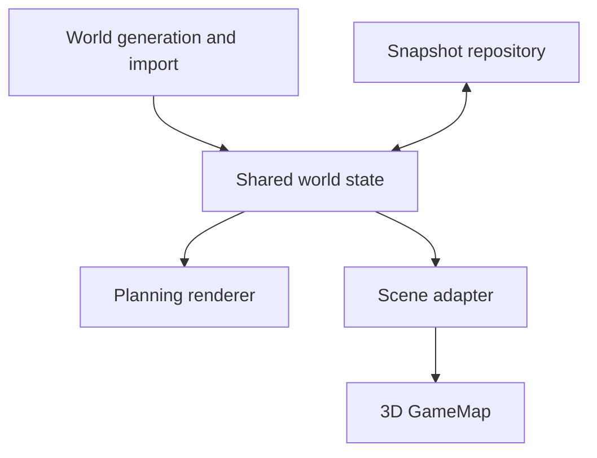

# Post-Launch Map Architecture and Roadmap

> Part of the [PangeaWorld architecture documentation](../../app_architecture.md).

## Post-Launch Map Improvement Roadmap — Deferred

> **Status:** Planned after the current game-launch work. This roadmap is intentionally not part of the active sprint scope. It preserves the target architecture and phased implementation guidance for a future map upgrade.

The map improvement will retain the current gameplay map as the authoritative baseline while introducing a shared, versioned world document and two consistent presentations: an overhead planning view and a stylized 3D player view. The architecture and delivery guidance below are the governing instructions for that later effort.

### Map Architecture

Shared world data and stylized 3D rendering

Version 1.0  |  9 September 2026

Build the map as one editable world with two presentations: an overhead planning view and a stylized 3D view for players. Both views must use the same terrain, settlements, route connections, construction rules, and saved revision. This document defines the data boundaries, rendering approach, and migration needed to make that work.

### Design direction

The visual target is a miniature continent with sculpted terrain, coherent regional art, small settlements, bridges, and restrained movement. Start with an angled orthographic camera and a direct overhead planning option. Preserve strategic readability as scenery becomes richer.

| Decision | Architecture |
| --- | --- |
| Shared foundation | A serializable WorldDocument is the source of truth. The generator creates new worlds; loading restores saved worlds. |
| Two presentations | Planning and 3D rendering are adapters over the same world. Selection and construction use the same entity IDs. |
| Controlled changes | A command service validates edits and applies each accepted change as one revision. |
| 3D technology | Use Three.js through React Three Fiber for the scene, with React DOM for controls and labels [1]. |
| Initial scope | One browser editing session, existing rail behavior, added road and city tools, and versioned saves. Shared online editing is a later integration. |

### Current implementation

`MapGenerator.js` already supplies seeded generation, triangular cells, edge connectivity, countries, city anchors, ports, and prebuilt railroads. `GameMap.jsx` combines generation, rendering, interaction, and cost tracking. Its snapshot loader regenerates the world and restores only saved railroad flags.

`map_prototype.html` has its own unseeded generation logic and requests 12 companies per country; the React generator requires 8 city anchors per country. Treat the React generator as the migration baseline, and make the prototype a client of shared data. Reconcile intentional gameplay differences explicitly.

## Components and responsibilities

Keep the domain model independent of React, Canvas, and Three.js. Rendering may derive meshes, labels, and decorative objects, but it cannot decide whether a route is legal or change the world while drawing.

World loading and rendering share one saved revision. User edits pass through the command service described later.

| Module | Responsibility |
| --- | --- |
| World generator | Create topology and starting entities from seed, world bounds, and generator configuration. Run for a new world or an explicit migration only. |
| World store | Hold the current document and revision. Apply validated patches; expose selectors for the views. |
| Commands and rules | Quote construction, validate legality, apply edits, and retain enough information for undo. |
| Snapshot repository | Validate, migrate, load, and save complete documents through a replaceable storage adapter. |
| Scene adapter | Build terrain geometry, route geometry, instance placements, and picking maps from world data. |
| Views and controls | Render the world, collect user intent, and keep camera, hover, selection, and previews in separate presentation state. |

Suggested boundaries are `map/domain`, `map/generation`, `map/persistence`, `map/rendering`, and `map/ui`. Keep the existing GameMap component as an integration entry point while moving these responsibilities into small modules.

## World document and coordinates

Use plain records and IDs in saved data. Avoid cyclic object references, Three.js objects, DOM elements, and runtime caches. Keep terrain classification, country membership, and city occupation separate so placing a city does not erase its underlying terrain.

| Record | Required information |
| --- | --- |
| World metadata | schemaVersion, generatorVersion, rulesVersion, worldId, revision, seed, worldWidth, worldDepth, and generation configuration. |
| Vertices | Stable vertex ID; map x and z coordinates; terrain height. Adjacent cells reference the same vertex heights. |
| Cells | Stable cell ID; three vertex IDs; biome or terrain type; countryId where known; buildability metadata. |
| Edges | Stable edge ID; two vertex IDs; adjacent cell IDs; passability; river crossing flag; construction weight. |
| Countries | Existing country ID and name; label anchor; art profile. Geometry is derived from member cells. |
| Cities | Stable city ID; anchor cell; footprint cells; route attachment node IDs; countryId; optional companyId; size tier; port and airport flags. |
| Route segments | Stable segment ID; graph edge ID; kind road or rail; construction record; optional bridge or tunnel structure ID. |
| Water and structures | River cell IDs and existing crossing flags; lake or waterbody geometry where applicable; bridge spans and tunnel endpoints. |
| Build records | Operation ID, project ID, committed revision, affected entity IDs, and the accepted construction quote. |

### Coordinate convention

Retain the current 800 by 600 map extent as world bounds. Convert legacy x to map x and legacy y to map z, with north at decreasing z. The renderer centers the scene using `(x - 400, height, z - 300)`. One map unit remains one world unit; elevation is in those same units. Viewport resizing changes the camera and drawing buffer, never world generation or IDs.

### Identity and derived data

Preserve legacy cell and edge IDs during migration and maintain an explicit mapping if a new ID is required. Create new city IDs independently of cell positions. Enforce one route segment per edge and transport kind. Rebuild adjacency indexes, boundaries, meshes, decorative placements, and label layouts after loading; do not save them as gameplay truth.

Use separate versioned random streams for gameplay generation and decoration. Adding another tree must not change city placement, route costs, or future gameplay randomness.

## Editing and persistence

### Construction transaction

Expose domain operations such as QuoteRoute, BuildRoute, PlaceCity, UpgradeCity, UndoEdit, and RedoEdit. These names describe interfaces rather than required library APIs. Each edit carries an operation ID and the world revision on which it was prepared.

- The active view resolves the pointer to a cell, city, or graph edge and submits a construction intent. A translucent preview is presentation state only.

- The command service quotes unique new segments and validates connectivity, passability, occupation, country rules, and any configured economy restrictions.

- Confirmation revalidates against the current revision. A stale quote is refreshed before commit; a repeated operation ID cannot apply the same build twice.

- Commit the complete accepted edit and its construction record atomically, increment the revision once, and notify both views.

- Notify render adapters and enqueue a detached snapshot of the revision independently. Saving must not depend on rendering success. Undo applies the inverse edit and its accounting adjustment as another revision.

### Route and city rules

Preserve existing rail legality and construction weights during the visual migration: 1 for a normal eligible edge, 3 for a river edge, and 1.5 for an eligible mountain edge, with river precedence. Keep ocean restrictions and designated mountain passes. Charge each new segment once per transport kind; existing segments retain their original accounting.

Roads use the same graph initially, with a configurable rules profile. For the first editor prototype, use the existing edge weights as a clearly identified provisional road quote. Keep road and rail occupation distinct. New cities require a buildable unoccupied land footprint and explicit route attachment nodes; city growth, company creation, and economy effects remain separate rules.

### Save and load contract

Save the complete world, including player edits, heights, city footprints, routes, and construction records. The seed is provenance and a new-world input; it is not a substitute for an edited world. A browser storage adapter can use IndexedDB first and be replaced by an application backend later.

Serialize writes in revision order. Validate schema, finite coordinates, unique IDs, and references before replacing the active world. Apply supported migrations to a copy, then hydrate runtime indexes and swap the validated document into the store. Keep the last successful save until the new write succeeds. Unsupported versions or failed saves must produce a recoverable message.

Camera position, hover, previews, animation phase, and quality settings belong outside the world document. Save user preferences separately if useful. Keep preexisting network valuation separate from the cost of a player project; the map must not invent a wallet or debit funds without an economy integration.

## Terrain and scene rendering

### Terrain surface

Convert map cells into terrain geometry with shared heights at adjoining vertices. Use continuous elevations for valleys, slopes, and ridges, then compute lighting normals. BufferGeometry supports positions, indices, normals, colors, and texture coordinates for this representation [2]. Group terrain into a modest number of chunks and material groups.

Keep elevations cosmetic for the first migration so they do not silently change pathfinding or construction prices. Sea level is zero. As starting art values, place low ground about 1 to 3 units above water, hills at 3 to 8, and major peaks at 8 to 20. Tune these values in the sample scene; they are visual proportions, not measured geography.

### Water and route alignment

The current rivers are generated without a height model. Preserve their cell footprints and crossing flags, then shape riverbeds and banks around them. Keep water surfaces connected, coastlines coherent, and bridges above water. Any redesign of river topology belongs to a versioned world-generation change.

Build road and rail meshes from the canonical graph. Smooth turns only inside the permitted route corridor, preserve junctions and endpoints, and sample the same terrain heights used for picking. Do not let a decorative curve cross an impassable cell. Bridges use explicit spans between banks; tunnel visuals use authorized mountain connections.

### Settlements and regional art

Place each settlement from its city anchor and footprint. Decorative buildings may vary deterministically inside that footprint. A large-city decoration cell must never become a second city entity. Save the city tier; derive its building arrangement from the art version and stable city ID.

Use a consistent miniature scale and lighting direction across all countries. Favor broad terrain color, sparse surface detail, and actual trees and rocks. Reserve country and company colors for borders, flags, signs, or selection treatments rather than tinting every surface.

### Camera and selection

Use an orthographic camera for the first 3D view; distance does not reduce the projected size of an object [3]. Start near a 45 degree downward view, constrain rotation, and provide overhead and reset controls. Change detail and label density with zoom; keep important text at a readable screen size.

Raycast against terrain and dedicated selection proxies, then map hits back to canonical IDs. Instanced objects need an instance-to-entity lookup. Resolve route snapping with a screen-space tolerance so it remains usable at different zoom levels. Decorative trees, smoke, and water must not intercept construction selections.

## Performance and failure handling

Design around measured workload. In one run of the supplied generator using seed PangeaGameSeed123 at 800 by 600, the world contained 7,791 cells, 11,843 edges, 64 city anchors, and 110 prebuilt railroad edges. These counts establish a representative fixture; they do not establish browser frame rate.

### Rendering budget

- Batch terrain into BufferGeometry chunks. Avoid a React component and separate draw call for every cell or route edge. Rebuild only chunks touched by terrain, route, or city changes.

- Use instancing for repeated trees, rocks, and building parts that share geometry and materials. InstancedMesh reduces draw calls for this case [4]. Group instances by asset and spatial chunk to retain useful visibility culling.

- Keep frame animation outside React state updates. Use frame deltas for motion and stable object references; React Three Fiber documents this distinction for fast updates [5].

- Render continuously while visible animation or camera motion requires it. For a still scene, use demand rendering and invalidate when the world, camera, or assets change [6]. Freeze decorative motion when the page is hidden or reduced motion is enabled.

- Reuse assets and materials, cap pixel density, restrict shadow coverage, and simplify distant objects. Dispose of replaced geometry and unused textures without disposing resources still shared by another instance.

### Proposed performance targets

| Measure | Initial target |
| --- | --- |
| Reference device | Record the actual laptop, browser version, resolution, quality preset, and fixture before measuring. |
| Navigation | Aim for 60 frames per second on the reference desktop setup; keep the lower-quality fallback usable at 30. |
| Interaction | Aim for visible hover or preview feedback within 100 ms for the representative map. |
| Build and save | Record command, render rebuild, and save durations separately. No interaction should wait on full world regeneration. |
| Resource stability | After repeated load and unload cycles, cached asset and geometry counts should stabilize. |

### Recovery behavior

Load a usable terrain and controls first, then decorative assets. A missing model should use a simple placeholder and retry path. If 3D initialization fails, offer the planning view against the same document. If saving fails, keep the active world available and offer retry or export. Rebuilding the scene after a graphics-context loss must not regenerate or discard the saved world.

Run generation or large geometry preparation in a worker only if profiling shows it blocks interaction. Tag asynchronous results with world ID and revision, and discard obsolete results so an earlier world cannot overwrite a newer one.

## Migration baseline and technical references

### Migration requirements

Convert the current generator output to a WorldDocument before replacing rendering. Preserve its starting entities, terrain, port assignments, passability, and rail links. Normalize terrain references to stable names or IDs; the current runtime uses object identity in several comparisons.

Existing snapshots contain triangles, edges, countries, and city summaries, but lack a complete versioned world contract and some entity details. Restore recorded values wherever available. Recover absent details only through a matching legacy generator and validated ID mapping. Do not infer lost country membership solely from a texture. Keep the original snapshot and report any field that cannot be recovered reliably.

For an old standalone prototype world created with Math.random, capture its live geometry and entities if preservation is required. A seed cannot reconstruct an arbitrary prior prototype session. Once migrated, both views must load the captured data instead of running separate generators.

| Compatibility check | Required result |
| --- | --- |
| Starting cities | For the React baseline, 8 anchors per country. Decorative footprint cells are excluded from the count. |
| Starting ports | Nordvik 2, Lunara 2, Drakmoor 1; the other five countries 0. Preserve Zephyria as landlocked. |
| Mountain connections | Preserve the existing designated passable edges, including the one-pass-per-mountain rule. |
| Saved edits | Roads, rails, added cities, upgrades, and height data survive reload with the same IDs and connections. |
| View parity | Changing the view or window size never changes construction eligibility, ownership, costs, or topology. |

### References

Implementation baseline: GameMap.jsx, MapGenerator.js, map_prototype.html, and the supplied terrain artwork. Technology references below were checked on 9 September 2026. Library-specific details should be confirmed against the versions selected for implementation.

[1] [React Three Fiber introduction](https://r3f.docs.pmnd.rs/getting-started/introduction)

[2] [Three.js BufferGeometry](https://threejs.org/docs/pages/BufferGeometry.html)

[3] [Three.js OrthographicCamera](https://threejs.org/docs/pages/OrthographicCamera.html)

[4] [Three.js InstancedMesh](https://threejs.org/docs/pages/InstancedMesh.html)

[5] [React Three Fiber performance pitfalls](https://r3f.docs.pmnd.rs/advanced/pitfalls)

[6] [React Three Fiber scaling performance](https://r3f.docs.pmnd.rs/advanced/scaling-performance)

### Map Implementation Instructions

Visual standards and phased delivery

Version 1.0  |  9 September 2026

Implement the shared-world architecture defined in this document and develop the visual style through a small complete scene before expanding to the full map. The goal is a readable miniature world in which players can plan connections, build infrastructure and cities, and see those choices appear in 3D.

### The first playable scene

Create one coastal region containing two towns, a mountain ridge, a short river, and a connection that crosses the river on a bridge. Use a fixed sample WorldDocument so both the planning and 3D views show exactly the same place. The scene must support selecting a destination, previewing a legal route, confirming construction, and saving and reloading the result.

A player should be able to look across the landscape, recognize the two towns, understand where the connection can go, and watch construction appear. Add one moving vehicle after the route works. Evaluate that scene before multiplying assets across the continent.

### Visual standards

- Use one stylized miniature language: simple silhouettes, softly lit surfaces, restrained texture contrast, and consistent proportions for buildings, trees, roads, and terrain.

- Make depth come from terrain height, real building volume, shoreline shape, and coherent shadows. Keep important routes visible against the ground.

- Use broad regional color and small variations. Keep individual leaves and dense repeating mountain illustrations out of continent-scale ground materials.

- Keep the triangular grid hidden in the scenic view. Show only relevant cells, edges, and restrictions while the player is planning.

- Use country names at the world scale and city names at closer scales. Keep the selected destination visible and readable in either view.

- Use calm animation: slow water, a few vehicles, small smoke plumes, and brief construction responses. Include reduced motion and a static quality option.

### First delivery boundary

Prioritize terrain, two settlements, one route and bridge, accurate selection, a useful camera, and reliable persistence. Detailed weather, day and night cycles, free camera flight, large traffic simulations, and multiplayer can follow after the core map works. Artwork and scene animation must not determine game outcomes.

Treat visual heights, camera angles, and quality budgets in these documents as starting design values. Keep current gameplay behavior during migration; place any new road, city, or growth rules in explicit configuration.

## Regional art and asset requirements

Use the existing country identities as art direction. These profiles describe proposed visuals; they do not redefine country boundaries, resource production, or construction rules.

| Country | Terrain and vegetation | Settlement character |
| --- | --- | --- |
| Terranova | Soft green plains, broad rivers, scattered deciduous trees | Open settlements, fields, and simple transport stations |
| Solhaven | Warm sand and dry grass with sparse vegetation | Light plaster, shade structures, and sunlit courtyards |
| Korvath | Brushland and muted green slopes | Compact towns with timber and stone details |
| Valdoria | Sandy desert, dunes, and exposed rock | Warm masonry and compact shaded buildings |
| Lunara | Red coastal cliffs and dry rocky ground | Warm roofs, stone terraces, and coastal docks |
| Nordvik | Snowy ridges and dark pine forests | Steep roofs, warm windows, and small harbors |
| Zephyria | Dense woodland, clear rivers, and sheltered valleys | Woodland settlements within a landlocked region |
| Drakmoor | Gray mountains, mossy rock, and mist accents | Heavy stone forms, mountain stations, and its starting port |

### Asset kit

Build a small reusable kit first: ground materials, one tree family with a few variants, rocks, several house forms, a station, a bridge module, a tunnel entrance, a dock, and one vehicle. Expand regional variations after the first scene demonstrates a consistent scale.

Use simple geometry during development, then import production models as glTF or GLB. Three.js provides GLTFLoader for glTF 2.0 assets [1]. Each model needs a stable asset ID, known origin, world-unit dimensions, material assignments, and bounds for placement and selection.

- Place a building origin at its base so it can sit on terrain consistently. Keep decorative geometry within the assigned city footprint.

- Keep materials and texture sizes modest and shared where practical. Add richer detail only when it is visible at the intended camera distance.

- Record source, usage rights, scale, and any required attribution with each asset. Use a plain placeholder when an asset is missing.

- Review every new asset beside a town, tree, vehicle, and mountain. Match shape language, contrast, and lighting before adding more variants.

## Build the shared foundation and sample scene

### Phase 1 Establish the world contract

Start from the existing React generator. Record its output for PangeaGameSeed123 at 800 by 600 as the migration fixture. Extract stable cells, edges, city anchors, country IDs, and built railroads into the WorldDocument described in the architecture.

- Add schema and generator versions, fixed world bounds, a revision counter, and explicit ID references. Separate country membership, terrain, and city occupation.

- Make new-world generation independent of viewport size. Loading a snapshot must restore its recorded geometry and edits.

- Introduce the world store, pure rule functions, command service, and snapshot adapter. Keep hover, camera position, and construction previews outside saved game data.

- Change the planning view to read the shared document. Make the standalone prototype use that same data contract when it is brought into the game.

- Verify that an accepted rail edit survives save and reload without a changed city count, route graph, or cost.

Phase completion: the planning view works from normalized saved data, preserves the current React baseline, and no longer relies on regeneration to restore edits.

### Phase 2 Build the miniature scene

Create a React Three Fiber scene using a fixed sample document. Add a centered terrain surface, simple sea and river surfaces, two blockout towns, a mountain ridge, one directional sun, and ambient fill. Use shared terrain heights for buildings, routes, and pointer selection.

- Add an angled orthographic camera with pan, zoom, overhead view, and reset. Keep camera bounds around the sample world.

- Render a rail connection and bridge from graph IDs. Implement a legal preview and confirmation through the command service.

- Map 3D selection back to the same IDs used in the planning view. Decorative objects should not block picking.

- Save and reload the scene after construction. Compare the route, quote, and selected entities in both views.

Phase completion: the scene has clear depth, connected terrain and water, readable towns, correct route selection, and matching saved behavior. Adjust the camera, proportions, and lighting here before producing the regional asset set.

## Expand the world and construction tools

### Phase 3 Render the full continent

Feed the migrated world into the scene adapter. Build terrain chunks, coastline geometry, river surfaces, city instances, and route geometry. Preserve the source world topology while adding cosmetic elevation.

- Keep adjoining terrain vertices aligned. Check coastline seams, riverbanks, mountain passes, and city foundations at close zoom.

- Render every existing city anchor once. Treat the second triangle of a large city as part of its footprint. Preserve the starting ports and Zephyria's landlocked geography.

- Add regional materials and vegetation from the art profiles. Place vegetation with a separate deterministic decorative seed and exclude routes, water, and city footprints.

- Show country labels from afar and city labels when useful. Prioritize selected and hovered locations, then suppress overlapping secondary labels.

- Keep the planning view available against the same world revision. Switching views must preserve the selection, active project, and preview intent.

Phase completion: all eight countries render coherently, every starting anchor remains identifiable, and the full map preserves route connectivity and construction rules.

### Phase 4 Add roads and city construction

Support road and rail as distinct segment kinds on the shared graph. Start with endpoint selection and a legal connected path preview. Route planning can choose a path through eligible edges; confirmation must still validate every selected segment.

- Display only the cost of unique new segments. Distinguish a river bridge and an authorized mountain connection in the preview. Keep curves inside valid corridors.

- Use an explicit provisional road rules profile for the editor, starting with the existing edge weights. Keep pricing configurable so a later balancing change does not require renderer changes.

- Add city placement on an unoccupied buildable land footprint, with explicit graph attachment nodes and a stable new city ID. Preview the footprint and explain invalid placement before confirmation.

- Save city type and size tier. Apply growth through an explicit UpgradeCity command or a future game-state event; derive the visible buildings from that saved tier.

- Provide cancel, undo, and redo for local edits, including construction records. Keep city placement in the editor free of wallet effects until the host game supplies a city quote and economy policy.

Phase completion: a player can add roads and cities, connect them, undo an edit, and reload the changed world. Existing company counts and starting cities must not be silently rebalanced by the visual work.

## Refine interaction and visual performance

### Phase 5 Add controlled motion

Animate one vehicle along an actual connected route before scaling traffic. Use the route graph for path continuity, with the vehicle positioned on the rendered route surface. The first vehicles are visual feedback and do not imply a transport economy.

- Add a brief construction animation after a successful commit. The final structure must remain correct when the animation is skipped or the world reloads midway.

- Add gentle water motion and a few local effects. Stop decorative motion when hidden and respect reduced motion. Keep labels and construction feedback stable.

- Use smooth camera transitions between overhead and angled views. Avoid automatically moving the camera away from a route the player is editing.

### Control behavior

| Action | Expected behavior |
| --- | --- |
| Select | Click or tap a visible city, route, or terrain target. Keep its ID and information stable when changing views. |
| Navigate | Drag to pan; wheel or pinch to zoom. Provide visible zoom and reset controls. A drag must not also place a route. |
| Build | Choose the road, rail, or city tool; inspect a translucent preview; confirm once. Invalid previews include a short reason. |
| Cancel and reverse | Escape or a visible Cancel control dismisses the preview. Undo and redo apply to committed edits. |
| Inspect | Keep costs, selected destination, and essential restrictions available without hover. Pair status colors with text or symbols. |

### Phase 6 Measure and simplify

Profile the full migrated fixture on a named reference device at a recorded resolution and quality level. Use the provisional navigation and response targets in the architecture. Measure while panning, previewing routes, committing edits, and loading saves.

- Batch repeated trees and buildings; merge terrain by chunk and material. Cap screen pixel density and reduce distant detail before removing useful interface information.

- Use lower quality settings to reduce shadow resolution, vegetation density, effects, and decorative vehicles. Map topology and interaction must stay identical.

- Check asset and geometry counts after repeated world loads. Dispose of unused resources and cancel or discard obsolete asynchronous work.

Phase completion: the full map remains responsive during editing, quality controls have measurable effects, and reduced motion, missing assets, and a 3D fallback all preserve access to the saved world.

## Verification and implementation handoff

Verify the behavior below with the migration fixture and an edited sample world. Use automated checks for the data and command rules, plus visual inspection for geometry, labels, and interaction. Record actual outcomes and any remaining limitations.

| Check | Pass condition |
| --- | --- |
| Generation and identity | The same versioned inputs produce the same topology and starting anchors. Resizing or changing views does not regenerate the world. |
| Starting invariants | The React baseline retains 8 city anchors per country, the 5 specified ports, Zephyria landlocked, and the designated mountain passes. |
| Persistence | New roads, rails, city footprints, tiers, and heights survive a save and reload with their original IDs. |
| Construction rules | Disconnected or impassable routes fail. Duplicate segments cost nothing extra. A stale or repeated command cannot double-build. |
| City placement | Invalid water or occupied footprints fail. A new city has a unique ID and usable attachment nodes; decoration never creates extra entities. |
| Undo and redo | Entities and construction accounting return to the correct state. Confirmed changes still reload correctly. |
| View parity | Both views select the same entity and show the same legal route, cost, and committed revision. |
| Visual continuity | Roads touch terrain, bridges clear water, tunnel entrances align, and terrain chunks have no visible cracks. |
| Readability | Labels remain readable without collisions at useful zoom levels. Routes and selected targets remain visible across regional terrain. |
| Recovery and performance | Failed assets, failed saves, and 3D initialization errors have usable recovery. Recorded frame and response results meet the chosen targets. |

### Handoff package

Deliver the world schema and migration notes, command and persistence interfaces, sample and migrated fixtures, the asset manifest, and a short setup guide. Include the selected library versions, actual performance measurements, and representative images of both views. Explain how to load a saved world and how to switch to the planning fallback.

Each implementation update should name the phase completed, the visible result, the behavior verified, and any remaining limitation. Keep new economy or world-generation changes separate from the rendering migration so their effects can be reviewed directly.

### Reference

[1] [Three.js GLTFLoader documentation](https://threejs.org/docs/pages/GLTFLoader.html)

This module is the canonical companion for post-launch map architecture. Technology reference checked on 9 September 2026.
