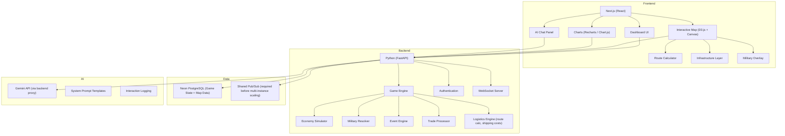

# Technical Architecture and Phase 1 Implementation

> Part of the [PangeaWorld architecture documentation](../../app_architecture.md).

## Technical Architecture

### Recommended Stack



### Why This Stack?
- **Backend (Python + FastAPI)**: FastAPI is lightning-fast, uses modern Python type hints (Pydantic), and is ideal for complex game logic, mathematical simulations, and AI integrations.
- **Frontend (React + Vite)**: A decoupled React single-page application built with Vite provides a fast, interactive user experience for the complex dashboards.
- **Neon PostgreSQL**: Complex relational data (nations, companies, rounds, decisions) uses managed PostgreSQL outside Render's ephemeral service filesystem.
- **Shared Pub/Sub**: The first Render deployment stays on one backend instance. Redis or equivalent shared pub/sub becomes mandatory before horizontal scaling.
- **D3.js/Mapbox**: Required for the interactive world map and complex data visualizations
- **Socket.io**: Real-time notifications when events fire or trade proposals arrive

---

## Verification Plan

### Automated Tests
- Seeded map invariant tests across a broad seed corpus: exactly 8 cities per nation; exactly 2 ports for Nordvik and Lunara, exactly 1 port for Drakmoor, 0 ports for all other nations; all ports assigned to eligible coastal cities; exactly 1 passable edge per mountain triangle; and zero passable edges touching ocean
- Unit tests for economy engine (CPI calculation, GDP computation, trade balance)
- Unit tests for military resolution algorithm
- Integration tests for round lifecycle (planning → submission → processing → results)
- API endpoint tests for all CRUD operations
- `npm test` — runs the implemented deterministic map-invariant suite; component tests will use React Testing Library when dashboard behavior is connected to live game state

### Manual Verification
- **Phase 1**: Single-player walkthrough — create a nation, run 3 rounds, verify economy math
- **Phase 2**: 4-player test — 2 nations, 1 president + 1 company each, test trade flows
- **Phase 3**: Full 8-nation stress test (7 player + Drakmoor AI) with instructor event injection and war scenario
- **Phase 4**: AI advisor conversation quality review with sample prompts
- **User testing**: Pilot with a small group of students before full classroom deployment

---

## Development Timeline Estimate

| Phase | Description | Estimated Duration |
|:---|:---|:---|
| **Phase 1** | Foundation — data model, economy engine, single dashboard | 6-8 weeks |
| **Phase 2** | Multiplayer — auth, rounds, trade, diplomacy | 4-6 weeks |
| **Phase 3** | Military, events, news system | 4-6 weeks |
| **Phase 4** | AI integration, analytics, instructor tools | 3-4 weeks |
| **Polish** | Testing, balancing, UX refinement | 2-3 weeks |
| **Total** | | **19-27 weeks** |

> [!WARNING]
> These estimates assume focused development effort. The economy simulation engine (Phase 1) is the hardest part — it needs to be mathematically sound and produce realistic-feeling results. I recommend we invest significant time in prototyping and tuning the simulation formulas before building the UI around them.

---

## Phase 1 Implementation Sprint (Sep 4–8, 2026)

> **Goal:** Complete Phase 1 ("Foundation & World Building — MVP") — a playable single-nation prototype with a core economy loop, connected dashboards, and a functioning backend.

> **Completion status (Sep 4, 2026): ✅ COMPLETE.** The playable Phase 1 scope is implemented and covered by a three-round acceptance test. Advanced multiplayer, Drakmoor AI, Gemini advisors, FMI, military, intelligence, sanctions, and full route-construction systems remain assigned to their later roadmap phases.

### Phase 1 Sprint Checklist — 5/5 Days Complete

- [x] **Day 1:** Data models, SQLite persistence, seed data, and nation/company/resource initialization
- [x] **Day 2:** Economy, resources, logistics, round lifecycle, and automatic fallback decisions
- [x] **Day 3:** Session, nation, company, market, decision, map, results, and news APIs
- [x] **Day 4:** React API client, shared game context, and live President/Executive dashboards
- [x] **Day 5:** Seeded events, end-to-end acceptance coverage, lint, and production-build verification

### Phase 0 Completion Status

| Component | Status | Key Files |
|:---|:---|:---|
| **Procedural Map Generator** | ✅ Complete | `frontend/src/utils/MapGenerator.js` (829 lines) |
| **React Canvas Map Renderer** | ✅ Complete | `frontend/src/components/GameMap.jsx` (634 lines) |
| **Seeded Map Invariant Tests** | ✅ Complete | `frontend/src/utils/MapGenerator.test.js` |
| **President Dashboard Shell** | ✅ Visual prototype | 5 tabs (Diplomacy, Financing, Indexes, Infrastructure, Intel) + AI Advisor + Project Modal |
| **Executive Dashboard Shell** | ✅ Visual prototype | 4 tabs (Decisions, Financials, Market, Sourcing) + AI Advisor + News Feed + Supply Chain Map |
| **Standalone Map Prototype** | ✅ Development preview | `frontend/public/map_prototype.html` |
| **FastAPI Backend** | ✅ Day 1 foundation | `backend/main.py`, `backend/database.py`, `backend/models/`, `backend/seed_data.py` |
| **Role Switching UI** | ✅ Working | `frontend/src/App.jsx` — President / Executive / Map toggle |

### Phase 1 Gap Analysis

| Requirement | Status | Priority |
|:---|:---|:---|
| **Data schema / models** (Nations, Companies, Resources, Rounds) | ✅ Day 1 complete | 🔴 Critical |
| **Economy Engine** (GDP, CPI, inflation, trade balances) | ✅ Complete | 🔴 Critical |
| **Resource Engine** (production, consumption, trade flows, scarcity) | ✅ Complete | 🔴 Critical |
| **Round Manager** (state transitions: planning → submission → processing → results) | ✅ Complete | 🔴 Critical |
| **Event Engine** (world events: weather, crises, market shocks) | ✅ Complete | 🟡 Important |
| **Nation design data** (8 nations with full resource profiles) | ✅ Day 1 complete | 🔴 Critical |
| **Logistics cost model** (landed cost = base + freight + tariffs + insurance) | ✅ Complete | 🟡 Important |
| **API endpoints** (CRUD for game state, decisions, snapshots) | ✅ Complete | 🔴 Critical |
| **Dashboard ↔ API integration** (live data replaces mock data) | ✅ Complete | 🔴 Critical |
| **Database setup** (persistent game state) | ✅ Day 1 complete | 🔴 Critical |
| **Map snapshot persistence** (seed → validate → store → reload) | ✅ Complete | 🟡 Important |

### ✅ Day 1 (Sep 4) — Data Models & Database Foundation — Complete

**Theme:** _"Build the skeleton — every entity in the game gets a Python model and a database table."_

#### [x] `backend/models/` — SQLAlchemy / Pydantic models

Implementation of the canonical [data schema design](./delivery-roadmap.md#data-schema-design):

- `Nation` — id, name, archetype, gdp, cpi, inflation, unemployment, trade_balance, military_atk, military_def, policies (tax, tariffs, subsidies), treasury
- `Company` — id, nation_id, name, revenue, cogs, gross_margin, net_profit, cash, market_share, products, supply_chain_config
- `Resource` — id, type (Energy/Minerals/Agriculture/Technology/Labor/Capital), nation_id, production_rate, stockpile, depletion_rate
- `Round` — id, game_session_id, number (1–7), status (planning/submitted/processing/complete), events, presidential_decisions, company_decisions
- `GameSession` — id, seed, map_snapshot, current_round, created_at, status
- `MapSnapshot` — id, session_id, validated_map_json (entire generated map stored after invariant validation)
- `Decision` — id, round_id, player_type (president/company), entity_id, decision_data (JSON), submitted_at

#### [x] `backend/database.py` — Database connection & session management
- SQLite for local development and isolated tests; Neon PostgreSQL is required for Render deployment.
- Synchronous SQLAlchemy with FastAPI dependency injection remains the initial production path. Add the PostgreSQL driver and managed schema migrations during release readiness; do not run SQLite-specific schema alteration logic against Neon.

#### [x] `backend/seed_data.py` — Nation starting profiles
- All 8 nations with resource profiles, starting GDP, military indices, and geographic data
- Starting resource allocations per nation (asymmetric by design)
- Starting company templates (10–15 per nation)

### ✅ Day 2 (Sep 5) — Economy & Resource Engines — Complete

**Theme:** _"The math that makes the simulation feel real."_

#### [x] `backend/engines/economy.py` — GDP, CPI, Inflation Engine
- `calculate_gdp(nation)` — sum of all company revenues + government spending + net exports
- `calculate_cpi(nation, round)` — weighted basket of 6 resource categories; CPI changes based on supply/demand
- `calculate_inflation(nation)` — (CPI_current / CPI_previous - 1) × 100
- `calculate_unemployment(nation)` — based on company headcount vs. labor pool
- `calculate_trade_balance(nation)` — total exports value - total imports value

#### [x] `backend/engines/resources.py` — Resource Production & Trade
- `produce_resources(nation, round)` — each nation produces based on rates; apply depletion
- `calculate_scarcity(resource_type)` — global supply vs. demand → price multiplier
- `process_trade(exporter, importer, resource, quantity, route)` — apply landed cost formula

#### [x] `backend/engines/logistics.py` — Landed Cost Calculator
- Implements the landed cost formula: `Landed Cost = Base Price + (Freight × Distance × Mode Multiplier) + Tariffs + Insurance + Port Fees`
- Mode multipliers: Sea ($2/unit), River ($5/unit), Rail ($12/unit), Air ($30/unit)
- Distance calculation from map grid (100km per edge)

#### [x] `backend/engines/round_manager.py` — Round Lifecycle
- `advance_phase(session)` — planning → presidential → company → processing → results
- `process_round(session)` — orchestrates all engines after both deadlines pass
- `apply_auto_decisions(entity)` — suboptimal defaults for missed submissions
- `generate_round_results(session)` — snapshots for all nations/companies

### ✅ Day 3 (Sep 6) — API Layer & Game Session Endpoints — Complete

**Theme:** _"Everything the frontend needs to talk to."_

#### [x] `backend/routes/sessions.py` — Game session management
- `POST /api/sessions` — create new game (generates seed, runs map generation, validates invariants, persists snapshot)
- `GET /api/sessions/{id}` — get session state (current round, phase, map)
- `POST /api/sessions/{id}/advance` — advance to next phase (triggers round processing)

#### [x] `backend/routes/nations.py` — Nation data & presidential actions
- `GET /api/sessions/{id}/nations` — all nations with current stats
- `GET /api/sessions/{id}/nations/{nation_id}` — detailed nation view (GDP, CPI, resources, military)
- `POST /api/sessions/{id}/nations/{nation_id}/decisions` — submit presidential decisions

#### [x] `backend/routes/companies.py` — Company data & executive actions
- `GET /api/sessions/{id}/companies` — all companies
- `GET /api/sessions/{id}/companies/{company_id}` — detailed company view (financials, supply chain)
- `POST /api/sessions/{id}/companies/{company_id}/decisions` — submit executive decisions

#### [x] `backend/routes/market.py` — Global market data
- `GET /api/sessions/{id}/market` — commodity prices, exchange rates, shipping index
- `GET /api/sessions/{id}/market/resources/{type}` — available suppliers with landed cost estimates

#### [x] `backend/main.py` — All routers wired into FastAPI

### ✅ Day 4 (Sep 7) — Frontend ↔ Backend Integration — Complete

**Theme:** _"Mock data out, live API data in."_

#### [x] `frontend/src/api/client.js` — API client
- Base URL config, fetch wrappers, error handling
- Functions: `createSession()`, `getSession()`, `getNations()`, `getNation()`, `getCompanies()`, `getCompany()`, `submitDecision()`, `getMarket()`, `advanceRound()`

#### [x] `frontend/src/context/GameContext.jsx` — React context for game state
- Holds current session, nation, company, round, and phase
- Auto-refreshes on round transitions
- Provides `useGame()` hook for all components

#### [x] President Dashboard tabs — live API data replaces mock data
- **IndexesTab**: Live GDP, CPI, inflation, unemployment, trade balance
- **InfrastructureTab**: Real infrastructure data from map snapshot + nation state
- **FinancingTab**: Live treasury, FMI debt status, budget allocation
- **DiplomacyTab**: Active treaties and proposals (simplified for Phase 1)
- **IntelTab**: Public data for other nations

#### [x] Executive Dashboard tabs — live API data replaces mock data
- **FinancialsTab**: Live revenue, COGS, margin, profit, cash
- **SourcingTab**: Real resource marketplace with landed cost estimates
- **MarketTab**: Live market share, competitor pricing, demand curves
- **DecisionsTab**: Functional form that submits to API
  - Pricing, hiring, production volume, R&D investment, and sourcing supplier/route decisions
  - Separate local draft save and server-confirmed submission states

### ✅ Day 5 (Sep 8) — Event Engine, Polish & End-to-End Verification — Complete

**Theme:** _"Play through a full 3-round single-nation game and fix everything that breaks."_

#### [x] `backend/engines/events.py` — World event system
- Event categories: Natural disasters, political crises, market shocks, health emergencies, tech breakthroughs
- `generate_round_events(session, round)` — randomly inject 1–2 minor events per round
- Events modify resource production, prices, persisted railroad infrastructure, and approval ratings

#### [x] `frontend/src/components/ExecutiveDashboard/Widgets/NewsFeed.jsx`
- Wire to `GET /api/sessions/{id}/news` endpoint
- Display system-generated event articles and round results

#### [x] `backend/tests/` — Backend test suite
- `test_day1_foundation.py` — schema and seed-data invariants
- `test_day2_engines.py` — economy, resources, logistics, events, phase transitions, auto-decisions, and three-round acceptance
- `test_api.py` — session, map, decision, sourcing/trade, results, and news endpoint integration

#### [x] End-to-End Verification

- [x] Create a new game session and verify map invariants pass
- [x] Submit presidential and company decisions for Rounds 1–3
- [x] Advance rounds and verify the economy engine produces sane outputs
- [x] Verify dashboards reflect updated state after each round
- [x] Confirm resource depletion, scarcity effects, and event injection work

**Verified:** all five acceptance steps are automated. Company sourcing moves authoritative stockpiles, uses map-based distance and landed cost, updates COGS/shipping costs and trade balances, and persists the selected supply chain in round results.

**Phase 1 verification baseline:** 16 backend tests passing, 2 deterministic frontend map tests passing, frontend lint completing without errors, and the Vite production build succeeding.

### Sprint Verification Commands
```powershell
# Frontend map invariants
Set-Location frontend
npm test

# Backend engine and API tests
Set-Location ../backend
.\.venv\Scripts\python.exe -m pytest tests -v
```

> [!NOTE]
> **Phase 1 retrospective:** Economy tuning remains an ongoing balancing activity, but it does not block the completed Phase 1 acceptance criteria.

---
